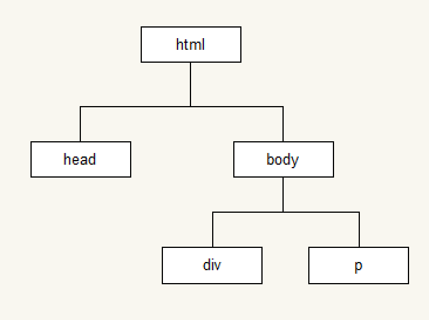
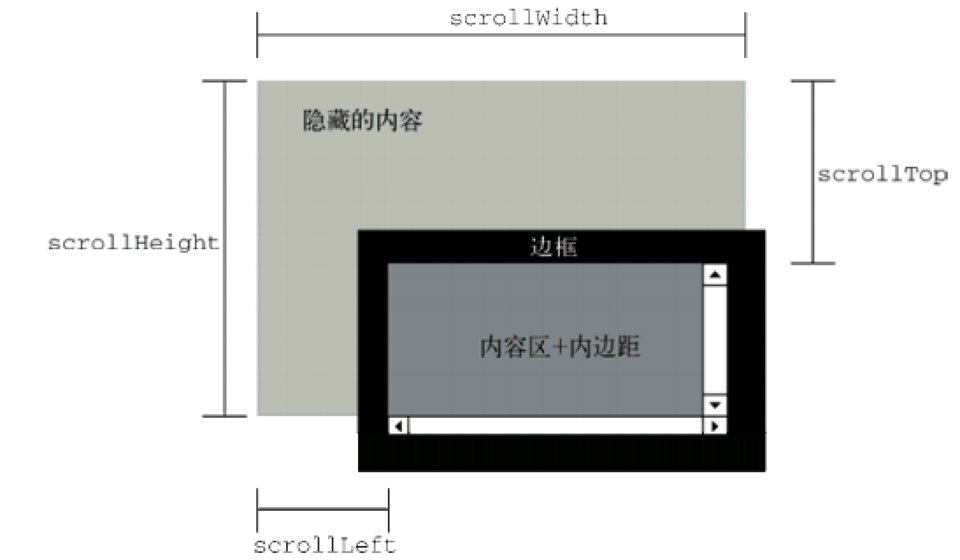

---
学习目标:
  - 掌握API和Web API的概念
  - 掌握常见浏览器提供的API的调用方式
  - 能通过Web API开发常见的页面交互功能
  - 能够利用搜索引擎解决问题
typora-copy-images-to: media
---

# Web API

## Web API介绍

### API的概念

API（Application Programming Interface,应用程序编程接口）是一些预先定义的函数，目的是提供应用程序与开发人员基于某软件或硬件得以访问一组例程的能力，而又无需访问源码，或理解内部工作机制的细节。

- 任何开发语言都有自己的API
- API的特征输入和输出(I/O)
  - var max =  Math.max(1, 2, 3);
- API的使用方法(console.log('adf'))

### Web  API的概念

浏览器提供的一套操作浏览器功能和页面元素的API(BOM和DOM)

此处的Web API特指浏览器提供的API(一组方法)，Web API在后面的课程中有其它含义


### 掌握常见浏览器提供的API的调用方式
[MDN-Web API](https://developer.mozilla.org/zh-CN/docs/Web/API)

### JavaScript的组成


#### ECMAScript - JavaScript的核心 

定义了JavaScript 的语法规范

JavaScript的核心，描述了语言的基本语法和数据类型，ECMAScript是一套标准，定义了一种语言的标准与具体实现无关

#### BOM - 浏览器对象模型

一套操作浏览器功能的API

通过BOM可以操作浏览器窗口，比如：弹出框、控制浏览器跳转、获取分辨率等 

#### DOM - 文档对象模型

一套操作页面元素的API

DOM可以把HTML看做是文档树，通过DOM提供的API可以对树上的节点进行操作

## DOM

### DOM的概念 

文档对象模型（Document Object Model，简称DOM），是[W3C](https://baike.baidu.com/item/W3C)组织推荐的处理[可扩展标记语言](https://baike.baidu.com/item/%E5%8F%AF%E6%89%A9%E5%B1%95%E7%BD%AE%E6%A0%87%E8%AF%AD%E8%A8%80)的标准[编程接口](https://baike.baidu.com/item/%E7%BC%96%E7%A8%8B%E6%8E%A5%E5%8F%A3)。它是一种与平台和语言无关的[应用程序接口](https://baike.baidu.com/item/%E5%BA%94%E7%94%A8%E7%A8%8B%E5%BA%8F%E6%8E%A5%E5%8F%A3)(API),它可以动态地访问程序和脚本，更新其内容、结构和[www](https://baike.baidu.com/item/www/109924)文档的风格(目前，HTML和XML文档是通过说明部分定义的)。文档可以进一步被处理，处理的结果可以加入到当前的页面。[DOM](https://baike.baidu.com/item/DOM/50288)是一种基于树的[API](https://baike.baidu.com/item/API/10154)文档，它要求在处理过程中整个文档都表示在[存储器](https://baike.baidu.com/item/%E5%AD%98%E5%82%A8%E5%99%A8)中。

DOM又称为文档树模型


- 文档：一个网页可以称为文档
- 节点：网页中的所有内容都是节点（标签、属性、文本、注释等）
- 元素：网页中的标签
- 属性：标签的属性

### DOM经常进行的操作

- 获取元素
- 对元素进行操作(设置其属性或调用其方法)
- 动态创建元素
- 事件(什么时机做相应的操作)

## 获取页面元素

### 为什么要获取页面元素

例如：我们想要操作页面上的某部分(显示/隐藏，动画)，需要先获取到该部分对应的元素，才进行后续操作

### 根据id获取元素

```javascript
var div = document.getElementById('main');
console.log(div);

// 获取到的数据类型 HTMLDivElement，对象都是有类型的
```

注意：由于id名具有唯一性，部分浏览器支持直接使用id名访问元素，但不是标准方式，不推荐使用。

### 根据标签名获取元素

```javascript
var divs = document.getElementsByTagName('div');
for (var i = 0; i < divs.length; i++) {
  var div = divs[i];
  console.log(div);
} 
```

### 根据name获取元素*

```javascript
var inputs = document.getElementsByName('hobby');
for (var i = 0; i < inputs.length; i++) {
  var input = inputs[i];
  console.log(input);
}
```

### 根据类名获取元素*

```javascript
var mains = document.getElementsByClassName('main');
for (var i = 0; i < mains.length; i++) {
  var main = mains[i];
  console.log(main);
}
```

### 根据选择器获取元素*

```javascript
var text = document.querySelector('#text');
console.log(text);

var boxes = document.querySelectorAll('.box');
for (var i = 0; i < boxes.length; i++) {
  var box = boxes[i];
  console.log(box);
}
```

- 总结

```
掌握
	getElementById()
	getElementsByTagName()
了解
	getElementsByName()
	getElementsByClassName()
	querySelector()
	querySelectorAll()
```

## 事件

事件：触发-响应机制

### 事件三要素

- 事件源:触发(被)事件的元素
- 事件名称: click 点击事件
- 事件处理程序:事件触发后要执行的代码(函数形式)

### 事件的基本使用

```javascript
var box = document.getElementById('box');
box.onclick = function() {
  console.log('代码会在box被点击后执行');  
};
```

### 案例
- 点击按钮弹出提示框
- 点击按钮切换图片

```html
<body>
   <input type="button" value="点我" id="btn">
   <br>
   

   <script>
     // 1 获取元素
     var btn = document.getElementById('btn');
     var mv = document.getElementById('mv');
     // 2 给按钮注册事件
     var flag = 1;  // 当flag的值是1 的时候 对应a.jpg   当flag的值是2的时候 对应 b.jpg
     btn.onclick = function () {
       // 3 切换图片
       if (flag === 1) {
          mv.src = 'images/a.jpg';
          flag = 2;
       } else if (flag === 2) {
          mv.src = 'images/b.jpg';
          flag = 1;
       }
     }
   </script>
</body>
```

## 属性操作

### 非表单元素的属性

href、title、id、src、className

```javascript
var link = document.getElementById('link');
console.log(link.href);
console.log(link.title);

var pic = document.getElementById('pic');
console.log(pic.src);
```

#### 案例：

##### 1. 点击按钮显示隐藏div

```html
<!DOCTYPE html>
<html lang="en">
<head>
  <meta charset="UTF-8">
  <title>Document</title>
  <style>
    #box {
      background-color: red;
      width: 200px;
      height: 200px;
    }

    .show {
      display: block;
    }

    .hidden {
      display: none;
    }
  </style>
</head>
<body>
   <input type="button" id="btn" value="隐藏">
   <br>
   <div id="box" >
     
   </div>
  <script>
    //1 获取元素
    var btn = document.getElementById('btn');
    //2 给按钮注册事件
    // isShow记录了box的状态，true 显示 ，false 隐藏
    var isShow = true;
    btn.onclick = function () {
      //3 控制div的显示隐藏
      var box = document.getElementById('box');
      if (isShow) {
        // 为什么DOM对象的对应的标签的class属性的名字叫做className ，应为class 在js中是关键字
        // 关键字不可以作为变量或者属性的名字
        box.className = 'hidden';

        // 如何设置按钮对应的元素的属性
        // btn.value = '显示';
        this.value = '显示';

        isShow = false;
      } else {
        box.className = 'show';
        this.value = '隐藏';
        isShow = true;
      }
      
    }

    //4 改变按钮中的文字
  </script>
</body>
</html>

```


##### 2. 取消标签a跳转默认行为

```html
<!DOCTYPE html>
<html lang="en">
<head>
  <meta charset="UTF-8">
  <title>Document</title>
</head>
<body>
   <a id="link" href="http://www.baidu.com">百度</a>
   <script>
     var link = document.getElementById('link');
     link.onclick = function () {
       alert('点击我了');

       // 取消a标签的默认行为（跳转到href）
       return false;
     }
   </script>
</body>
</html>

```

	##### 3. 美女画廊

```html

<!DOCTYPE html>
<html>
<head lang="en">
    <meta charset="UTF-8">
    <title></title>
    <style type="text/css">
        body {
            font-family: "Helvetica","Arial",serif;
            color: #333;
            background-color: #ccc;
            margin: 1em 10%;
        }
        h1 {
            color: #333;
            background-color: transparent;
        }
        a {
            color: #c60;
            background-color: transparent;
            font-weight: bold;
            text-decoration: none;
        }
        ul {
            padding: 0;
        }
        li {
            float: left;
            padding: 1em;
            list-style: none;
        }
        #imagegallery {
        }

        #imagegallery a {
            margin: 0px 20px 20px 0px;
            padding: 0px;
            display: inline;
        }

        #imagegallery a img {
            border: 0;
        }
    </style>
</head>
<body>
<h2>
    美女画廊
</h2>

<div id="imagegallery">
    <a href="images/1.jpg" title="美女A">
        
    </a>
    <a href="images/2.jpg" title="美女B">
        
    </a>
    <a href="images/3.jpg" title="美女C">
        
    </a>
    <a href="images/4.jpg" title="美女D">
        
    </a>
</div>

<div style="clear:both"></div>


<p id="des">选择一个图片</p>
    <script>
        //1 获取到所有的a标签
        var imagegallery = document.getElementById('imagegallery');
        var links = imagegallery.getElementsByTagName('a');
        //2 给所有的a标签注册事件
        for (var i = 0; i < links.length; i++) {
            // 所有的a标签对应的元素
            var link = links[i];
            // 注册事件
            link.onclick = function () {
                //4 切换图片
                // 获取占位的大`的img标签
                var image = document.getElementById('image');
                // 把img标签的src属性 设置为当前点击的a标签的href
                //不能使用link.href，因为循环结束后，link指向的是最后一个a标签
                image.src = this.href;
                
                //5 设置p标签的内容
                var des = document.getElementById('des');
                // 当前点击的a标签的title属性
                // this.title
                // 如何设置p标签中显示的内容
                // console.dir(des);
                des.innerText = this.title;

                //3 取消a的默认行为
                return false;
            }
        }

        // 当循环结束之后 link是谁？？
        // link 是最后一个a标签
        // console.log(link);
        
        
    </script>
</body>
</html>

```


##### 4. innerHTML和innerText

```javascript
var box = document.getElementById('box');
box.innerHTML = '我是文本<p>我会生成为标签</p>';
console.log(box.innerHTML);
box.innerText = '我是文本<p>我不会生成为标签</p>';
console.log(box.innerText);
```
- HTML转义符

```
"		&quot;
'		&apos;
&		&amp;
<		&lt;   // less than  小于
>		&gt;   // greater than  大于
空格	   &nbsp;
©		&copy;
```

- innerHTML和innerText的区别

```html
<!DOCTYPE html>
<html lang="en">
<head>
  <meta charset="UTF-8">
  <title>Document</title>
</head>
<body>
  <div id="box">
    <p></p>
    <p></p>
    <span></span>
    我一个div
    <span>这是一个span</span>
  </div>

  <b>123</b> &quot;
  &lt;b&gt;
  1231231     &nbsp;&nbsp;&nbsp;&nbsp;&nbsp;&nbsp;abadf
  <script>
    var box = document.getElementById('box');
    console.log(box.id)
    console.dir(box);

    // // innerHTML  innerText 
    // // 获取开始标签和结束标签之间的内容
    // // 
    // // innerHTML  获取内容的时候，如果内容中有标签，会把标签页获取到
    // // 原封不动把内容获取到
    console.log(box.innerHTML);
    // // innerText  获取内容的时候，如果内容中有标签，会把标签过滤掉
    // // innerText 会把前后的换行和空白都去掉
    console.log(box.innerText);


    // 设置标签之间的内容
    // box.innerHTML = '';  // 清空内容
    
    // 通过innerHTML 设置内容，如果内容中带标签，会以HTML的方式来解析
    // box.innerHTML = '<b>黑马</b>程序猿';
    // 
    // 通过innerText 设置内容，如果内容中带标签，在网页上会把标签显示出来
    box.innerText = '<b>黑马</b>程序猿';
  </script>
  

</body>
</html>

```

##### 5. innerText和textContent

```
<body>
  <div id="box">
    我是一个box
    <b>hello</b>
  </div>
  <script>
    // innerText  最早出现在IE浏览器中
    // 
    // 浏览器兼容问题
    // 
    // 老版本的firefox浏览器不支持innerText
    // 2016的时候 已经把innerText 在DOM中规定为正式的标准属性
    // 
    // textContent
    
    var box = document.getElementById('box');
    // 都会把标签过滤
    // 前后的空白和一些换行去掉
    console.log(box.innerText);
    // 原封不动的把内容输出
    console.log(box.textContent);
    /*
    //console.log(box.innerText);

    我是一个box hello

	//console.log(box.textContent);
    我是一个box
    hello
  
    */
  </script>
</body>
```


##### 6. innerText和textContent的兼容性处理

```html
<body>
  <div id="box">
    hello
  </div>
  <script>
    // // 如何知道。浏览器是否支持元素的某个属性
    // var box = document.getElementById('box');

    // // 当属性不存在的时候返回的是  undefined
    // console.log(typeof box.a);
    // // 当属性存在的时候返回的是 该属性的类型
    // console.log(typeof box.id);


    var box = document.getElementById('box');
    console.log(getInnerText(box));

    // 处理innerText的兼容性问题
    function getInnerText(element) {
      // 判断当前浏览器 是否支持元素的innerText属性，支持innerText 使用element.innerText获取内容
      // 如果不支持innerText属性，使用element.textContent获取内容
      
      if (typeof element.innerText === 'string') {
        return element.innerText;
      } else {
        return element.textContent;
      }
    }

    // box.innerHTML = 'hello world';

    // 设置内容的时候
    // innerText(textContent)       当设置不含标签的内容的时候应该使用innerText，效率高
    // innerHTML 
  </script>
</body>
```


### 表单元素属性

- value 用于大部分表单元素的内容获取(option除外)
- type 可以获取input标签的类型(输入框或复选框等)
- disabled 禁用属性
- checked 复选框选中属性
- selected 下拉菜单选中属性

#### 案例

##### 1. 点击按钮禁用文本框

```html
<body>
  <input type="button" value="按钮" id="btn">
  <input type="button" value="设置文本框的值" id="btn1">

  <br>
  <input type="text"  id="txt" value='123'>
  <script>
    // 获取元素
    var btn = document.getElementById('btn');
    // 注册事件
    btn.onclick = function () {
      var txt = document.getElementById('txt');
      console.log(txt.value);
      console.log(txt.type);
      // 当html中的标签的属性，只有一个值的时候
      // DOM中对应的元素的属性值是布尔类型
      console.log(txt.disabled);
      txt.disabled = true;
    }

    var btn1 = document.getElementById('btn1');
    btn1.onclick = function () {
      var txt = document.getElementById('txt');
      // 设置文本框中的内容
      txt.value = 'hello world';
    }
  </script>
</body>
```

##### 2. 给文本框赋值，获取文本框的值

```html
<body>
  <input type="text"><br>
  <input type="text"><br>
  <input type="text"><br>
  <input type="text"><br>
  <input type="text"><br>
  <input type="text"><br>
  <input type="text"><br>
  <input type="text"><br>
  <input type="text"><br>
  <input id="btn" type="button" value="获取文本框的值">
  <script>
    // 1 当页面加载完毕，给所有的文本框赋值
    var inputs = document.getElementsByTagName('input');
    for (var i = 0; i < inputs.length; i++) {
      var input = inputs[i];
      // 根据type属性 判断是否是文本框
      if (input.type === 'text') {
        input.value = i;
      }
    }

    // 2 当点击按钮的时候，获取所有文本框的值，并使用 | 分割输出
    // 0|1|2
    var btn = document.getElementById('btn');
    btn.onclick = function () {
      var s = '';
      for (var i = 0; i < inputs.length; i++) {
        var input = inputs[i];
        // 判断是否是文本框
        if (input.type === 'text') {
          s += input.value + '|';
        }
      }
      // 把最后一个| 去掉
      s = s.substr(0, s.length - 1);
      console.log(s);
    }
  </script>
</body>

<body>
  <input type="text"><br>
  <input type="text"><br>
  <input type="text"><br>
  <input type="text"><br>
  <input type="text"><br>
  <input type="text"><br>
  <input type="text"><br>
  <input type="text"><br>
  <input type="text"><br>
  <input id="btn" type="button" value="获取文本框的值">
  <script>
    // 1 当页面加载完毕，给所有的文本框赋值
    var inputs = document.getElementsByTagName('input');
    for (var i = 0; i < inputs.length; i++) {
      var input = inputs[i];
      // 根据type属性 判断是否是文本框
      if (input.type === 'text') {
        input.value = i;
      }
    }

    // 2 当点击按钮的时候，获取所有文本框的值，并使用 | 分割输出
    // 0|1|2
    var btn = document.getElementById('btn');
    btn.onclick = function () {
      var array = [];
      for (var i = 0; i < inputs.length; i++) {
        var input = inputs[i];
        // 判断是否是文本框
        if (input.type === 'text') {
           array.push(input.value);
        }
      }
      console.log(array.join('|'));
    }
  </script>
</body>
```

##### 3. 检测用户名是否是3-6位，密码是否是6-8位，如果不满足要求高亮显示文本框

```html
<!DOCTYPE html>
<html lang="en">
<head>
  <meta charset="UTF-8">
  <title>Document</title>
  <style>
    .bg {
      background-color: yellow;
    }
  </style>
</head>
<body>
    <input type="text" id="txtUserName"> <br>
    <input type="password" id="txtUserPassword"> <br>
    <input type="button" value=" 登 录 " id="btnLogin">
    <script>
      // 检测用户名是否是3-6位，密码是否是6-8位，如果不满足要求高亮显示文本框
      var btnLogin = document.getElementById('btnLogin');

      btnLogin.onclick = function () {
        // 检测用户名是否是3-6位，密码是否是6-8位
        var txtUserName = document.getElementById('txtUserName');
        var txtUserPassword = document.getElementById('txtUserPassword');

        //检测用户名是否是3-6位
        if (txtUserName.value.length < 3 || txtUserName.value.length > 6) {
          txtUserName.className = 'bg';
          return;
        } else {
          txtUserName.className = '';
        }

        // 密码是否是6-8位
        if (txtUserPassword.value.length < 6 || txtUserPassword.value.length > 8) {
          txtUserPassword.className = 'bg';
          return;
        } else {
          txtUserPassword.className = '';
        }

        // 
        console.log('执行登录');
      }
    </script>
</body>
</html>

```

##### 4. 设置下拉框中的选中项

```html
<body>
  <input type="button" value="设置" id='btnSet'>
  <select id="selCities">
    <option value="1">北京</option>
    <option value="2">上海</option>
    <option value="3">杭州</option>
    <option value="4">郑州</option>
    <option value="5">武汉</option>
  </select>

  <script>
    // 1 给按钮注册事件
    var btnSet = document.getElementById('btnSet');
    btnSet.onclick = function () {
      // 2 获取下拉框中的所有option
      var selCities = document.getElementById('selCities');
      var options = selCities.getElementsByTagName('option');
      // 3 随机生成索引
      // Math.random() -> [0, 1)
      // Math.random() * 5 -> [0, 5)
      var randomIndex = parseInt(Math.random() * options.length);
      // 4 根据索引获取option，并让option选中
      var option = options[randomIndex];
      option.selected = true;
    }
  </script>
</body>
```

##### 5. 搜索文本框

```html
<!DOCTYPE html>
<html lang="en">
<head>
  <meta charset="UTF-8">
  <title>Document</title>
  <style>
    .gray {
      color: gray;
    }

    .black {
      color: black;
    }
  </style>
</head>
<body>
  <input type="text" class="gray" value="请输入搜索关键字" id="txtSearch"> 
  <input type="button" value="搜索" id="btnSearch">
  <script>
    // 当文本框获得焦点，如果文本框里的内容是  请输入搜索关键字 清空文本框，并且让字体变为黑色
    
    var txtSearch = document.getElementById('txtSearch');
    // 获取焦点的事件  focus
    txtSearch.onfocus = function () {
      if (this.value === '请输入搜索关键字') {
        this.value = '';
        this.className = 'black';
      }
    }

    // 当文本框失去焦点，如果文本框里的内容为空  还原文本框里的文字，并且让字体变为灰色
    // 失去焦点的事件  blur
    txtSearch.onblur = function () {
      // 判断文本框中的内容为空
      // if (this.value === '')
      if (this.value.length === 0 || this.value === '请输入搜索关键字') {
        this.value = '请输入搜索关键字';
        this.className = 'gray';
      }
    }
  </script>
</body>
</html>

```

##### 6. 全选反选

```html

<!DOCTYPE html>
<html>
<head lang="en">
    <meta charset="UTF-8">
    <title></title>
    <style>
        * {
            padding: 0;
            margin: 0;
        }

        .wrap {
            width: 300px;
            margin: 100px auto 0;
        }

        table {
            border-collapse: collapse;
            border-spacing: 0;
            border: 1px solid #c0c0c0;
            width: 300px;
        }

        th,
        td {
            border: 1px solid #d0d0d0;
            color: #404060;
            padding: 10px;
        }

        th {
            background-color: #09c;
            font: bold 16px "微软雅黑";
            color: #fff;
        }

        td {
            font: 14px "微软雅黑";
        }

        tbody tr {
            background-color: #f0f0f0;
        }

        tbody tr:hover {
            cursor: pointer;
            background-color: #fafafa;
        }
    </style>

</head>
<body>
  <div class="wrap">
      <table>
          <thead>
            <tr>
                <th>
                    <input type="checkbox" id="j_cbAll" />
                </th>
                <th>商品</th>
                <th>价钱</th>
            </tr>
          </thead>
          <tbody id="j_tb">
            <tr>
                <td>
                    <input type="checkbox" />
                </td>
                <td>iPhone8</td>
                <td>8000</td>
            </tr>
            <tr>
                <td>
                    <input type="checkbox" />
                </td>
                <td>iPad Pro</td>
                <td>5000</td>
            </tr>
            <tr>
                <td>
                    <input type="checkbox" />
                </td>
                <td>iPad Air</td>
                <td>2000</td>
            </tr>
            <tr>
                <td>
                    <input type="checkbox" />
                </td>
                <td>Apple Watch</td>
                <td>2000</td>
            </tr>

          </tbody>
      </table>
      <input type="button" value="  反 选  " id="btn">
  </div>
  <script>
     var j_tb = document.getElementById('j_tb');
     var inputs = j_tb.getElementsByTagName('input');
     // 1 全选
     // 1.1 获取父checkbox，注册点击事件
     var j_cbAll = document.getElementById('j_cbAll');
     j_cbAll.onclick = function () {
       // 1.2 找到所有子的checkbox，让这些checkbox的状态跟父checkbox保持一致
      
       for (var i = 0; i < inputs.length; i++) {
         var input = inputs[i];
         if (input.type === 'checkbox') {
          // 让子的checkbox的选中状态，和父checkbox的选中状态一致
           input.checked = this.checked;
         }
       }
     }
     
     // 2 当点击子的checkbox，如果所有的子的checkbox都被选中了，让父的checkbox也选中
     // 如果有一个子的checkbox没有被选中，父的checkbox也不被选中
     
     // 此处的循环，是遍历所有子的checkbox，注册点击事件
     for (var i = 0; i < inputs.length; i++) {
       var input = inputs[i];
       // 判断是否是checkbox
       if (input.type !== 'checkbox') {
        // 结束当前循环，继续下一次循环
         continue;
       }
       // 给子的checkbox注册点击事件
       input.onclick = function () {
         checkAllCheckBox();
       }
     }
     

     // 判断父的checkbox的状态 封装成函数
     function checkAllCheckBox() {
       // 假设所有的子的checkbox都被选中了
         var isAllChecked = true;
         // 判断是否所有的子的checkbox都被选中了
         for (var i = 0; i < inputs.length; i++) {
           var input = inputs[i];
           if (input.type !== 'checkbox') {
             continue;
           }
           // 判断当前的所有checkbox是否都被选中
           if (!input.checked) {
             isAllChecked = false;
           }
         }
         // 设置父的checkbox的状态
         j_cbAll.checked = isAllChecked;
     }

     // 3 反选
     // 3.1 给反选按钮注册点击事件
     var btn = document.getElementById('btn');
     btn.onclick = function () {
        // 3.2 找到所有的子的checkbox，让其反选
        for (var i = 0; i < inputs.length; i++) {
          var input = inputs[i];
          // 判断是否是checkbox
          if (input.type !== 'checkbox') {
            continue;
          }
          // 让子的checkbox反选
          input.checked = !input.checked;
          // 设置父的checkbox的状态
          checkAllCheckBox();
        }
     }
     
  </script>
</body>
</html>

```

### 自定义属性操作

- getAttribute() 获取标签行内属性
- setAttribute() 设置标签行内属性
- removeAttribute() 移除标签行内属性
- 与element.属性的区别: 上述三个方法用于获取任意的行内属性。

```html
<body>
  <div id="box" age="18" personId="1">张三</div>
  <script>
    var box = document.getElementById('box');
    // 自有的属性
    // console.log(box.id);
    // // 自定义属性  -- 不能使用下面的方式获取到box元素对应的div标签的的自定义属性
    // console.log(box.age);
    // console.log(box.personId);

    // 获取自定义属性的值 getAttribute()
    // console.log(box.getAttribute('age'));
    // console.log(box.getAttribute('personId'));

    // 设置自定义属性
    box.setAttribute('sex', 'male');
    box.setAttribute('class', 'test');

    // 移除属性 
    box.removeAttribute('age');
    box.removeAttribute('id');
  </script>
```

### 样式操作

- 使用style方式设置的样式显示在标签行内
```javascript
var box = document.getElementById('box');
box.style.width = '100px';
box.style.height = '100px';
box.style.backgroundColor = 'red';
```

- 注意

  通过样式属性设置宽高、位置的属性类型是字符串，需要加上px

##### 1. common.js

```javascript
    //common.js
    function my$(id) {
       return document.getElementById(id);
    }
```


```html
<!DOCTYPE html>
<html lang="en">
<head>
  <meta charset="UTF-8">
  <title>Document</title>
  <style>
    .cls {
      width: 100px;
      height: 100px;
      background-color: red;
    }
  </style>
</head>
<body>
  <input type="button" id="btn" value=" 点我 "> <br>
  <div id="box"></div>  

  <script src="common.js"></script>
  <script>
    // 操作样式的时候，使用类样式 使用style？
    // 当设置多个样式属性的时候使用类样式方便
    // 当设置样式属性比较少的时候使用style比较方便
    // 
    // 
    //common.js
    // function my$(id) {
    //    return document.getElementById(id);
    // }

    // 
    // 1 类样式
    // my$('btn').onclick = function () {
    //   my$('box').className = 'cls';
    // }
    // 2 使用style
    my$('btn').onclick = function () {
      // 当设置宽度和高度的时候必须带单位，如果不带单位，有错误
      var box = my$('box');
      box.style.width = '200px';
      box.style.height = '200px';
      box.style.backgroundColor = 'red';
    }

  </script>
</body>
</html>
```

##### 2. 开关灯

```html
<body>
  <input type="button" value="关灯" id="btn">

  <script src="common.js"></script>
  <script>
    // 是否开灯  false 关灯状态  true 开灯状态
    var isOpen = true;
    my$('btn').onclick = function () {
      if (isOpen) {
        document.body.style.backgroundColor = 'black';
        this.value = '开灯';
        isOpen = false;
      } else {
        document.body.style.backgroundColor = 'white';
        this.value = '关灯';
        isOpen = true;
      }
    }
  </script>
  
</body>
```

##### 3. 隐藏显示二维码


```html

<!DOCTYPE html>
<html>
<head lang="en">
    <meta charset="UTF-8">
    <title></title>
    <style>
        .nodeSmall {
            width: 50px;
            height: 50px;
            background: url(images/bgs.png) no-repeat -159px -51px;
            position: fixed;
            right: 10px;
            top: 40%;
        }
        .erweima {
            position: absolute;
            top: 0;
            left: -150px;
        }
  /*      .nodeSmall a {
            display: block;
            width: 50px;
            height: 50px;
        }*/
        .hide {
            display: none;
        }
        .show {
            display: block;
        }
    </style>
</head>
<body>
    <div class="nodeSmall" id="node_small">
        <div class="erweima hide" id="er">
            
        </div>
    </div>
    <script src="common.js"></script>
    <script>
        // 当鼠标移入  onmouseover
        // 当鼠标移出  onmouseout
        var nodeSmall = my$('node_small');
        nodeSmall.onmouseover = function () {
            // my$('er').className = 'erweima show';
            my$('er').className = my$('er').className.replace('hide', 'show'); 
        }


        nodeSmall.onmouseout = function () {
            // my$('er').className = 'erweima hide';
            my$('er').className = my$('er').className.replace('show', 'hide');
        }
    </script>
</body>
</html>

```

##### 4. 高亮显示文本框

```html
<body>
  <input type="text"><br>
  <input type="text"><br>
  <input type="text"><br>
  <input type="text"><br>
  <input type="text"><br>
  <input type="text"><br>
  <input type="text"><br>
  <input type="text"><br>
  <input type="button" value=" 提交 ">
  <script>
    var inputs = document.getElementsByTagName('input');
    for (var i = 0; i < inputs.length; i++) {
      var input = inputs[i];
      // 判断input是否是文本框
      if (input.type !== 'text') {
        continue;
      } 
      // 让当前正在输入的文本框 高亮显示
      input.onfocus = function () {
        // 让所有的文本框去掉高亮的效果
         for (var i = 0; i < inputs.length; i++) {
           var input = inputs[i];
           if (input.type !== 'text') {
             continue;
           }
           // 去除所有文本框高亮显示
           input.style.backgroundColor = '';
         }
        
        // 当前文本框高亮显示
        this.style.backgroundColor = 'lightgray';
        
      }
    }
  </script>
</body>
```

##### 5. 设置div的大小和位置

```html
<!DOCTYPE html>
<html lang="en">
<head>
  <meta charset="UTF-8">
  <title>Document</title>
  <style>
    #box {
      width: 100px;
      height: 100px;
      background-color: pink;
    }

    .cls {
      width: 200px;
      height: 200px;
      position: absolute;
      top: 100px;
      left: 100px;
      background-color: pink;
    }
  </style>
</head>
<body>
  <input type="button" value=" 点我 " id="btn">
  <br>
  <div id="box"></div>
  
  <script src="common.js"></script>
  <script>
    my$('btn').onclick = function () {
      var box = my$('box');
      // 改变box的大小和位置
      // 使用class
      // box.className = 'cls';
      // 
      // 使用style  设置大小和位置的时候 数字必须带单位
      box.style.width = '200px';
      box.style.height = '200px';

      box.style.position = 'absolute';
      box.style.left = '200px';
      box.style.top = '200px';

      console.log(box.style);
    }

  </script>
</body>
</html>

```

##### 6. 隔行变色和高亮显示

```html
<!DOCTYPE html>
<html lang="en">
<head>
  <meta charset="UTF-8">
  <title>Document</title>
</head>
<body>
  <ul id="mv">
    <li>西施</li>
    <li>貂蝉</li>
    <li>王昭君</li>
    <li>杨玉环</li>
    <li>芙蓉姐姐</li>
  </ul>
  <script>
    // 1 隔行变色
    // 获取到所有的li，判断奇数行和偶数行
    var mv = document.getElementById('mv');
    var lists = mv.getElementsByTagName('li');

    for (var i = 0; i < lists.length; i++) {
      var li = lists[i];
      // 判断当前的li 是奇数行 还是偶数行
      if (i % 2 === 0) {
        // i是偶数 ， 但是当前是奇数行
        // 设置奇数行的背景颜色
        li.style.backgroundColor = 'red';
      } else {
        // 设置偶数行的背景颜色
        li.style.backgroundColor = 'green';
      }
    }
   
    

    // 2 鼠标放上高亮显示
    // 
    // 2.0 给所有的li 注册事件  鼠标经过和鼠标离开的两个事件
    for (var i = 0; i < lists.length; i++) {
      var li = lists[i];
       // 2.1 鼠标放到li上，高亮显示当前的li
       var bg;
       li.onmouseover = function () {
         // 鼠标放到li上的时候，应该记录li当前的颜色
         bg = this.style.backgroundColor;

         this.style.backgroundColor = 'yellow';
       }
       // 2.2 鼠标离开li，还原原来的颜色
       li.onmouseout = function () {
         // 鼠标离开，还原原来的颜色
         this.style.backgroundColor = bg;
       }
    }
  </script>
</body>
</html>

```

##### 7. tab切换

```html

<!DOCTYPE html>
<html>
<head lang="en">
    <meta charset="UTF-8">
    <title></title>
    <style>
        * {margin:0; padding: 0;}
        ul {
            list-style-type: none;
        }
        .box {
            width: 400px;
            height: 300px;
            border: 1px solid #ccc;
            margin: 100px auto;
            overflow: hidden;
        }
        .hd {
            height: 45px;
        }
        .hd span {
            display:inline-block;
            width: 90px;
            background-color: pink;
            line-height: 45px;
            text-align: center;
            cursor: pointer;
        }
        .hd span.current {
            background-color: purple;
        }
        .bd div {
            height: 255px;
            background-color: purple;
            display: none;
        }
        .bd div.current {
            display: block;
        }
    </style>

</head>
<body>
    <div class="box">
        <div class="hd" id="hd">
            <span class="current">体育</span>
            <span>娱乐</span>
            <span>新闻</span>
            <span>综合</span>
        </div>
        <div class="bd" id="bd">
            <div class="current">我是体育模块</div>
            <div>我是娱乐模块</div>
            <div>我是新闻模块</div>
            <div>我是综合模块</div>
        </div>
    </div>
    <script src="common.js"></script>
    <script>
        // 1 鼠标放到tab栏高亮显示，其它tab栏取消高亮
        var hd = my$('hd');
        var spans = hd.getElementsByTagName('span');
        for (var i = 0; i < spans.length; i++) {
            var span = spans[i];
            // 通过自定义属性，记录当前span的索引
            span.setAttribute('index', i);
            // 注册事件
            span.onmouseover = fn
        }

        // 鼠标经过的事件处理函数
        function fn() {
            // 让所有的span取消高亮显示
            for (var i = 0; i < spans.length; i++) {
                var span = spans[i];
                span.className = '';
            }
            // 当前的span高亮显示
            this.className = 'current';

            // 2 tab栏对应的div 显示，其它div隐藏
            // 所有的div 隐藏
            var bd = my$('bd');
            var divs = bd.getElementsByTagName('div');
            for (var i = 0; i < divs.length; i++) {
                var div = divs[i];
                div.className = '';
            }
            // 当前span对应的div显示
            // 获取自定义属性的值
            var index = parseInt(this.getAttribute('index')) ;
            divs[index].className = 'current';
            
        }
        // var fn = function () {
                
        // }   
       
        
    </script>
</body>
</html>

```

##### 8. 模拟DOM结构

```html
<!DOCTYPE html>
<html lang="en">
<head>
  <meta charset="UTF-8">
  <title>Document</title>
</head>
<body>
  <div id="box">hello</div>
  <p id="p">world</p>
  <!-- 这是注释 -->
  <script>
    var box = document.getElementById('box');
    console.dir(box);
    // 创建一些列具有相同属性的对象，构造函数

    // 获取对象没有的属性，属性的值是undefined
    function Node(options) {
      // 设置属性的默认值
      this.className = options.className || '';
      this.id = options.id || '';
      // 跟节点相关的属性
      // 节点的名称，如果是元素的节点的话，是标签的名称
      this.nodeName = options.nodeName || '';
      // 节点的类型  如果是元素节点 1 属性节点 2  文本节点 3  数值类型
      this.nodeType = options.nodeType || 1;
      // 记录节点的值，如果是元素节点，始终是null
      this.nodeValue = options.nodeValue || null;
      // 记录子节点
      this.children = options.children || [];
    }
    

    // 创建html节点
    var html = new Node({
      nodeName: 'html'
    });

    // 创建head节点
    var head = new Node({
      nodeName: 'head'
    });
    // 设置html中的子节点 head
    html.children.push(head);
    // console.dir(html)

    // body 
    var body = new Node({
      nodeName: 'body'
    })
    // 设置html中的子节点 body
    html.children.push(body);

    // div
    var div = new Node({
      nodeName: 'div'
    })
    // p
    var p = new Node({
      nodeName: 'p'
    })

    // 设置body的子节点
    body.children.push(div);
    body.children.push(p);

    console.dir(html);


    // 在运行的时候，浏览器内部维护了一颗DOM树
    // 1 深刻理解DOM
    // 2 了解节点相关的属性  nodeName  nodeType  nodeValue
    // 3 了解节点的层次结构
  </script>
</body>
</html>

```


##### 9. 总结

```html
<!DOCTYPE html>
<html lang="en">
<head>
  <meta charset="UTF-8">
  <title>Document</title>
</head>
<body>
  <div id="box"></div>
  <script>
    // DOM  文档对象模拟
    // 
    // 常见的DOM操作
    //    获取元素   getElementById()  getElementsByTagName()
    //    给元素注册事件    onclick   onmouseover  onmouseout  onfocus  onblur
    //    操作元素的属性
    //        非表单元素   href  title  src alt等
    //        表单元素     type  value  checked  disabled  selected
    //        公共属性     id   className style
    //        样式操作     className  style
    //        自定义属性   setAttribute()   getAttribute()   removeAttribute()
  </script>
</body>
</html>
```


### 类名操作

- 修改标签的className属性相当于直接修改标签的类名
```javascript
var box = document.getElementById('box');
box.className = 'show';
```

### 案例

- 开关灯
- 点击按钮改变div的背景颜色
- 图片切换二维码案例
- 当前输入的文本框高亮显示
- 点击按钮改变div的大小和位置
- 列表隔行变色、高亮显示
- tab选项卡切换


## 创建元素的三种方式

### document.write()

```javascript
document.write('新设置的内容<p>标签也可以生成</p>');
```

### innerHTML

```javascript
var box = document.getElementById('box');
box.innerHTML = '新内容<p>新标签</p>';
```

### document.createElement()

```javascript
var div = document.createElement('div');
document.body.appendChild(div);
```

### 性能问题

- innerHTML方法由于会对字符串进行解析，需要避免在循环内多次使用。
- 可以借助字符串或数组的方式进行替换，再设置给innerHTML
- 优化后与document.createElement性能相近

```html
<!DOCTYPE html>
<html lang="en">
<head>
    <meta charset="UTF-8">
    <title>效率测试</title>
</head>
<body>
</body>
<script>
    function fn() {
        var d1 = +new Date();

        var array = [];

        var str = '';
        for ( var i = 0; i < 1000; i++ ) {
            document.body.innerHTML += '<div style="width:100px; height:2px; border:1px solid blue;"></div>';
        }
        var d2 = +new Date();
        console.log( d2 - d1 );
    }
    fn();
</script>

</html>

----------------------
<!DOCTYPE html>
<html lang="en">
<head>
    <meta charset="UTF-8">
    <title>效率测试</title>
    
</head>
<body>
    
</body>

<script>
    function fn() {
        var d1 = +new Date();
        var array = [];
        for ( var i = 0; i < 1000; i++ ) {
            array.push('<div style="width:100px; height:2px; border:1px solid blue;"></div>');
        }
        document.body.innerHTML = array.join('');
        var d2 = +new Date();
        console.log( d2 - d1 );
    }
    fn();
</script>

</html>

-------------------
<!DOCTYPE html>
<html lang="en">
<head>
    <meta charset="UTF-8">
    <title>效率测试</title>
    
</head>
<body>
    
</body>

<script>
    function fn() {
        var d1 = +new Date();
        
        for ( var i = 0; i < 1000; i++ ) {
            var div = document.createElement('div');
            div.style.width = '100px';
            div.style.height = '2px';
            div.style.border = '1px solid red';
            document.body.appendChild( div );
        }
        var d2 = +new Date();
        console.log( d2 - d1 );
    }
    fn();
</script>

</html>
```


### 案例

- 动态创建列表，高亮显示
- 根据数据动态创建表格

## 节点操作

```javascript
var body = document.body;
var div = document.createElement('div');
body.appendChild(div);

var firstEle = body.children[0];
body.insertBefore(div, firstEle);

body.removeChild(firstEle);

var text = document.createElement('p');
body.replaceChild(text, div);

```


##### 案例：

###### 1. 操作元素

```html
<!DOCTYPE html>
<html lang="en">
<head>
  <meta charset="UTF-8">
  <title>Document</title>
</head>
<body>
  <input type="button" value="按钮" id="btn">
  <ul id="ul">
    <li>111</li>
    <li>222</li>
    <li>333</li>
  </ul>

  <ul id="sel">
    
  </ul>
  <script>
    // createElement()
    // appendChild()
    // removeChild()
    // 
    // 把元素插入到页面的指定位置
    // insertBefore()
    // 把当前元素的标签进行替换
    // replaceChild()
    // 
    var btn = document.getElementById('btn');
    btn.onclick = function () {
      var li = document.createElement('li');
      li.innerText = 'abc';

      // 把li 插入到ul中的第一个位置
      // var ul = document.getElementById('ul');
      // ul.insertBefore(li, ul.children[0]);
      // 
      // 
      // replaceChild()
      // var div = document.createElement('div');
      // div.innerText = 'div';
      // var ul = document.getElementById('ul');
      // ul.replaceChild(div, ul.children[0]);
      // 
      // 
      // appendChild()
      var ul = document.getElementById('ul');
      var sel = document.getElementById('sel');
      sel.appendChild(ul.children[0]);
    }
  </script>
</body>
</html>

```

###### 2. 选择水果

- 下面只是实现了从左到右移动，从右到左移动类似

```html
<!DOCTYPE html>
<html lang="en">
<head>
    <meta charset="UTF-8">
    <title>Title</title>
    <style>
        select {
            width:200px;
            height: 200px;
            background-color: #33cccc;
            font-size: 20px;
        }
    </style>
</head>
<body>
  <select id="all" multiple="multiple">
    <option>苹果</option>
    <option>橘子</option>
    <option>梨</option>
    <option>西瓜</option>
    <option>水蜜桃</option>
  </select>

  <input type="button" value=">>" id="btn1">
  <input type="button" value="<<" id="btn2">
  <input type="button" value=">" id="btn3">
  <input type="button" value="<" id="btn4">

  <select id="select" multiple="multiple">
  </select>
  
  <script src="common.js"></script>
  <script>
    var all = my$('all');
    var select = my$('select');

    all.children[0].onclick = function () {
      alert('hello');
    }

    // 1 全部选择
    my$('btn1').onclick = function () {
      // 先获取子元素的个数，将来再发生变化不会受影响
      // 现在len的值始终是当前获取到的all.children.length 当前个数5
       var len = all.children.length;
       for (var i = 0; i < len; i++) {
         var option = all.children[0];
         select.appendChild(option);
      }
      // 
      // 
      // 使用这种方式移动子元素的话，如果子元素有事件，移动之后元素的事件丢失
      //select.innerHTML = all.innerHTML;
      // 当我们是用innerHTML 清空子元素的时候
      // 如果子元素有事件，此时会发生内存泄漏
      //all.innerHTML = '';  // 清空标签之间的内容
    }

    // 3 移动选中的水果
    my$('btn3').onclick = function () {
      // 找到所有选中的option
      var array = []; // 存储选中的option
      for (var i = 0; i < all.children.length; i++) {
        var option = all.children[i];
        if (option.selected) {
          array.push(option);
          // 去掉当前option的选中效果
          option.selected = false;
        }
      }

      // 把数组中的option移动到第二个select中
      for (var i = 0; i < array.length; i++) {
        var option = array[i];
        select.appendChild(option);
      }
    }
  </script>
</body>
</html>
```


### 节点属性

- nodeType  节点的类型
  - 1 元素节点
  - 2 属性节点
  - 3 文本节点 
- nodeName  节点的名称(标签名称)
- nodeValue  节点值
  - 元素节点的nodeValue始终是null

```html
<!DOCTYPE html>
<html lang="en">
<head>
  <meta charset="UTF-8">
  <title>Document</title>
</head>
<body>
  <div id="box">
    <span>span</span>
    <p>p标签</p>
    <!-- 这里是注释 -->
  </div>
  <script>
     var box = document.getElementById('box');
     console.dir(box)
    // 节点的层次结构
    // 
    // 父子结构
    // parentNode  父节点  只有一个
    // childNodes  子节点  有很多个
    // children    子元素
    // 
   //  var box = document.getElementById('box');
   //  console.log(box.parentNode);
   // console.log(box.childNodes);

   // // 属性节点、元素节点、文本节点、注释节点
   // for (var i = 0; i < box.childNodes.length; i++) {
   //   // 找到box中所有的子元素
   //   var node = box.childNodes[i];
   //   // 判断当前的子节点是否是元素节点
   //   if (node.nodeType === 1) {
   //     console.log(node);
   //   }
   // }
   // 
   // 
   // 有没有能够直接获取子元素的属性？ children
   var box = document.getElementById('box');
   console.log(box.children);  // 所有的子元素
  </script>
</body>
</html>
```


### 模拟文档树结构



```javascript
function Node(option) {
  this.id = option.id || '';
  this.nodeName = option.nodeName || '';
  this.nodeValue = option.nodeValue || '';
  this.nodeType = 1;
  this.children = option.children || [];
}

var doc = new Node({
  nodeName: 'html'
});
var head = new Node({
  nodeName: 'head'
});
var body = new Node({
  nodeName: 'body'
})
doc.children.push(head);
doc.children.push(body);

var div = new Node({
  nodeName: 'div',
  nodeValue: 'haha',
});

var p = new Node({
  nodeName: 'p',
  nodeValue: '段落'
})
body.children.push(div);
body.children.push(p);

function getChildren(ele) {
  for(var i = 0; i < ele.children.length; i++) {
    var child = ele.children[i];
    console.log(child.nodeName);
    getChildren(child);
  }
}
getChildren(doc);
```

#### 案例

##### 1. 获取子元素

```html
<!DOCTYPE html>
<html lang="en">
<head>
  <meta charset="UTF-8">
  <title>Document</title>
</head>
<body>
  <ul id="mv">
    <li>西施</li>
    <li>貂蝉</li>
    <li>王昭君</li>
    <li>杨玉环</li>
    <li>芙蓉姐姐</li>
  </ul>

  <div>
    <p></p>
    <div></div>
    <span></span>
  </div>
  <script>
    var mv = document.getElementById('mv');

    // mv.getElementsByTagName('li');

    // mv.childNodes  所有子节点，包含文本等节点
    // mv.children    所有的子元素，即li
    // 判断是否有子节点
    if (mv.hasChildNodes()) {
      for (var i = 0; i < mv.children.length; i++) {
        var li = mv.children[i];
        if (i % 2 === 0) {
          // 奇数行
          li.style.backgroundColor = 'red';
        } else {
          // 偶数行
          li.style.backgroundColor = 'green';
        }
      }
    }
  </script>
</body>
</html>
```

##### 2. 获取第一个和最后一个子节点和子元素

```html
<!DOCTYPE html>
<html lang="en">
<head>
  <meta charset="UTF-8">
  <title>Document</title>
</head>
<body>
  <div id="box">
    <div>这是一个广告图片</div>
    <ul>
      <li>这是一个列表</li>
    </ul>
    <span>说明性文字</span>
  </div>

  <script>
    // box.firstChild   获取第一个子节点
    // box.firstElementChild    获取第一个子元素， 有兼容性问题，从IE9以后支持
    // 
    // box.lastChild    获取最后一个子节点
    // box.lastElementChild     获取最后一个子元素， 有兼容性问题，从IE9以后支持
    var box = document.getElementById('box');
    // console.log(box.firstChild);
    // console.log(box.firstElementChild);

    var ele = getFirstElementChild(box);
    console.log(ele);

    // 处理浏览器兼容性
    function getFirstElementChild(element) {
        var node, nodes = element.childNodes, i = 0;
        while (node = nodes[i++]) {
            if (node.nodeType === 1) {
                console.log(node)
                return node;
            }
        }
        return null;
    }
  </script>
</body>
</html>
```

##### 3. 菜单

```html
<!DOCTYPE html>
<html lang="en">
<head>
    <meta charset="UTF-8">
    <title>Title</title>
    <style>
        #menu ul li {
            list-style-type: none;
            width: 80px;
            height: 30px;
            line-height: 30px;
            background-color:beige;
            text-align: center;
            float: left;
            margin-left: 5px;
        }

        #menu ul li.current {
            background-color: burlywood;
        }

        #menu ul li a {
            text-decoration: none;
        }
    </style>
</head>
<body>
    <div id="menu">
        <ul>
            <li class="current"><a href="javascript:void(0)">首页</a></li>
            <li><a href="javascript:undefined">播客</a></li>
            <li><a href="javascript:void(0)">博客</a></li>
            <li><a href="javascript:void(0)">相册</a></li>
            <li><a href="javascript:void(0)">关于</a></li>
            <li><a href="javascript:void(0)">帮助</a></li>
        </ul>
    </div>

    <script src="common.js"></script>
    <script>
      // void 是运算符   
      // 执行void后面的表达式，并始终返回undefined
      //void(0) 和 undefined 等效
      
      var menu = my$('menu');
      // 获取menu中的ul
      var ul = getFirstElementChild(menu);

      for (var i = 0; i < ul.children.length; i++) {
        var li = ul.children[i];
        // 获取li中的a标签
        var link = getFirstElementChild(li);
        // 注意：此时是把函数赋给onclick 而不是函数的调用
        link.onclick = linkClick;
      }

      function linkClick() {
         // 所有的li取消高亮显示 
         for (var i = 0; i < ul.children.length; i++) {
           var li = ul.children[i];
           li.className = '';
         }

        // 让当前a标签所在的li高亮显示
        // 
        // this是当前点击的a标签对应的元素
        this.parentNode.className = 'current';

        // 取消后续内容的执行
        return false;
      }

      // ele.firstChild  
      // ele.firstElementChild

    </script>
</body>
</html>
```


### 节点层级

 

```javascript
var box = document.getElementById('box');
console.log(box.parentNode);
console.log(box.childNodes);
console.log(box.children);
console.log(box.nextSibling);
console.log(box.previousSibling);
console.log(box.firstChild);
console.log(box.lastChild);
```

- 注意

  childNodes和children的区别，childNodes获取的是子节点，children获取的是子元素

  nextSibling和previousSibling获取的是节点，获取元素对应的属性是nextElementSibling和previousElementSibling获取的是元素

  ​	nextElementSibling和previousElementSibling有兼容性问题，IE9以后才支持

- 总结

```
节点操作，方法
	appendChild()
	insertBefore()
	removeChild()
	replaceChild()
节点层次，属性
	parentNode
	childNodes
	children
	nextSibling/previousSibling
	firstChild/lastChild
```

#### 案例

##### 1. 兄弟节点

```html
<!DOCTYPE html>
<html lang="en">
<head>
  <meta charset="UTF-8">
  <title>Document</title>
</head>
<body>
  <div id="box">
    <div>这是一个区域1</div>
    <div>这是一个区域2</div>
    <div id="c3">这是一个区域3</div>
    <div>这是一个区域4</div>
    <div>这是一个区域5</div>
  </div>
  <script>
    var c3 = document.getElementById('c3');

    // nextSibling  下一个兄弟节点
    // nextElementSibling   下一个兄弟元素
    // 
    // previousSibling   上一个兄弟节点
    // previousElementSibling    上一个兄弟元素
    // console.log(c3.nextSibling);
    // console.log(c3.previousSibling);
    
    // console.log(c3.nextElementSibling);
    // console.log(c3.previousElementSibling);


    console.log(getNextElementSibling(c3));
    // 获取下一个兄弟元素
   function getNextElementSibling(element) {
      var el = element;
      while (el = el.nextSibling) {
        if (el.nodeType === 1) {
            return el;
        }
      }
      return null;
    }
  </script>
</body>
</html>
```

##### 2. 动态创建元素

###### 1. 使用document.write

```html
<!DOCTYPE html>
<html lang="en">
<head>
  <meta charset="UTF-8">
  <title>Document</title>
</head>
<body>
  <h1>标题</h1>
  
  <input type="button" value="按钮" id="btn">
  <script>
    // 动态创建元素
    // document.write()
    // element.innerHTML
    // document.createElement()
    var btn = document.getElementById('btn');
    btn.onclick = function () {
      // 当点击按钮的时候使用document.write()输出内容，会把之前的整个页面覆盖掉
      document.write('Hello <p>World</p>');
    }
  </script>

  <a id="ibangkf" href="http://www.ibangkf.com">网站客服</a>
  <script type="text/javascript" src="http://c.ibangkf.com/i/c-xxxzzzz123.js"></script>
</body>
</html>
```

###### 2. 使用document.innerHTML

```html
<!DOCTYPE html>
<html lang="en">
<head>
  <meta charset="UTF-8">
  <title>Document</title>
</head>
<body>
  <input type="button" value="按钮" id="btn">
  <div id="box"></div>
  <script>
    // element.innerHTML 
    // var box = document.getElementById('box');
    // box.innerHTML = 'Hello <p>World</p>';
    
    // var btn = document.getElementById('btn');
    // btn.onclick = function () {
    //   var box = document.getElementById('box');
    //   box.innerHTML = 'Hello <p>World</p>';
    // }
    // 
    // 
    // 点击按钮 生成列表，鼠标放上高亮显示的效果
    
    // 模拟数据
    // var datas = ['西施', '貂蝉', '凤姐', '芙蓉姐姐'];
    // var btn = document.getElementById('btn');
    // btn.onclick = function () {
    //   var box = document.getElementById('box');
    //   box.innerHTML = '<ul>';  // 重新绘制

    //   // 遍历数据
    //   for (var i = 0; i < datas.length; i++) {
    //     var data = datas[i];
    //     box.innerHTML += '<li>' + data + '</li>';   // 重新绘制
    //   }

    //   // box.innerHTML = box.innerHTML + '</ul>'
    //   box.innerHTML += '</ul>';  // 重新绘制
    // }
    // 
    // 
    // 优化1
    // var datas = ['西施', '貂蝉', '凤姐', '芙蓉姐姐'];
    // var btn = document.getElementById('btn');
    // btn.onclick = function () {
    //   var box = document.getElementById('box');
    //   var html = '<ul>';    // 重新开辟内存 需要耗费时间

    //   // 遍历数据
    //   for (var i = 0; i < datas.length; i++) {
    //     var data = datas[i];
    //     html += '<li>' + data + '</li>';    // 因为字符串不可变 重新开辟内存 需要耗费时间
    //   }
    //   html += '</ul>';   // 因为字符串不可变 重新开辟内存 需要耗费时间

    //   box.innerHTML = html;   // 重新绘制
    // }


    // 优化2
    var datas = ['西施', '貂蝉', '凤姐', '芙蓉姐姐'];
    var btn = document.getElementById('btn');
    btn.onclick = function () {
      var box = document.getElementById('box');

      // 使用数组替代字符串拼接
      var array = [];
      array.push('<ul>');

      // 遍历数据
      for (var i = 0; i < datas.length; i++) {
        var data = datas[i];
        array.push('<li>' + data + '</li>');
      }
      array.push('</ul>');   

      box.innerHTML = array.join('');  
      // 当li 生成到页面之后，再从页面上查找li 注册事件
      
    }
  </script>
</body>
</html>

```

###### 3. 使用document.createElement

```html
<!DOCTYPE html>
<html lang="en">
<head>
  <meta charset="UTF-8">
  <title>Document</title>
</head>
<body>
  <div id="box">
    <div>111</div>
  </div>
  <script>
    // 在内存中创建一个DOM对象
    var p = document.createElement('p');
    // 设置对象的属性
    p.innerText = 'hello';
    p.style.color = 'red';

    // 把p元素，放到DOM树上
    var box = document.getElementById('box');
    box.appendChild(p);

  </script>
</body>
</html>

```

##### 3.动态生成列表

###### common.js

```javascript
function my$(id) {
  return document.getElementById(id);
}

// 处理浏览器兼容性
// 获取第一个子元素
function getFirstElementChild(element) {
    var node, nodes = element.childNodes, i = 0;
    while (node = nodes[i++]) {
        if (node.nodeType === 1) {
            return node;
        }
    }
    return null;
}

// 处理浏览器兼容性
// 获取下一个兄弟元素
 function getNextElementSibling(element) {
    var el = element;
    while (el = el.nextSibling) {
      if (el.nodeType === 1) {
          return el;
      }
    }
    return null;
  }


// 处理innerText和textContent的兼容性问题
// 设置标签之间的内容
function setInnerText(element, content) {
  // 判断当前浏览器是否支持 innerText
  if (typeof element.innerText === 'string') {
    element.innerText = content;
  } else {
    element.textContent = content;
  }
}

// 处理注册事件的兼容性问题
// eventName, 不带on，  click  mouseover  mouseout
function addEventListener(element, eventName, fn) {
  // 判断当前浏览器是否支持addEventListener 方法
  if (element.addEventListener) {
    element.addEventListener(eventName, fn);  // 第三个参数 默认是false
  } else if (element.attachEvent) {
    element.attachEvent('on' + eventName, fn);
  } else {
    // 相当于 element.onclick = fn;
    element['on' + eventName] = fn;
  }
}

// 处理移除事件的兼容性处理
function removeEventListener(element, eventName, fn) {
  if (element.removeEventListener) {
    element.removeEventListener(eventName, fn);
  } else if (element.detachEvent) {
    element.detachEvent('on' + eventName, fn);
  } else {
    element['on' + eventName] = null;
  }
}

// 获取页面滚动距离的浏览器兼容性问题
// 获取页面滚动出去的距离
function getScroll() {
  var scrollLeft = document.body.scrollLeft || document.documentElement.scrollLeft;
  var scrollTop = document.body.scrollTop || document.documentElement.scrollTop;
  return {
    scrollLeft: scrollLeft,
    scrollTop: scrollTop
  }
}

// 获取鼠标在页面的位置，处理浏览器兼容性
function getPage(e) {
  var pageX = e.pageX || e.clientX + getScroll().scrollLeft;
  var pageY = e.pageY || e.clientY + getScroll().scrollTop;
  return {
    pageX: pageX,
    pageY: pageY
  }
}

```


###### 1. 动态创建列表


```html
<!DOCTYPE html>
<html lang="en">
<head>
  <meta charset="UTF-8">
  <title>Document</title>
</head>
<body>
  <input type="button" value="按钮" id="btn">
  <div id="box"></div>

  <script src="common.js"></script>
  <script>
    var datas = ['西施', '貂蝉', '凤姐', '芙蓉姐姐'];
    // 点击按钮 动态创建列表，鼠标放上高亮显示
    my$('btn').onclick = function () {
      // 动态创建ul，内存中创建对象
      var ul = document.createElement('ul');
      // 把ul 放到页面上    把ul放到DOM树上，并且会重新绘制
      my$('box').appendChild(ul);

      for (var i = 0; i < datas.length; i++) {
        var data = datas[i];
        // 在内存中动态创建li
        var li = document.createElement('li');
        // 把li添加到DOM树，并且会重新绘制
        ul.appendChild(li);
        // 设置li中显示的内容
        // li.innerText = data;
        setInnerText(li, data);

        // 给li注册事件
        li.onmouseover = liMouseOver;
        li.onmouseout = liMouseOut;
      }
    }
    // 当鼠标经过li的时候执行
    function liMouseOver() {
      // 鼠标经过高亮显示
      this.style.backgroundColor = 'red';
    }

    function liMouseOut() {
      // 鼠标离开取消高亮显示
      this.style.backgroundColor = '';
    }

    // 设置标签之间的内容
    // function setInnerText(element, content) {
    //   // 判断当前浏览器是否支持 innerText
    //   if (typeof element.innerText === 'string') {
    //     element.innerText = content;
    //   } else {
    //     element.textContent = content;
    //   }
    // }
  </script>
</body>
</html>

```

##### 4. 动态创建表格

```html
<!DOCTYPE html>
<html lang="en">
<head>
  <meta charset="UTF-8">
  <title>Document</title>
  <style>
    #box table {
      border-collapse: collapse;
    }
  </style>
</head>
<body>
  <div id="box"></div>
  <script src="common.js"></script>
  <script>
    // var s = {name: 'zs', subject: '语文', score: 90};
    // 模拟数据
    var datas = [
      {name: 'zs', subject: '语文', score: 90},
      {name: 'ls', subject: '数学', score: 80},
      {name: 'ww', subject: '英语', score: 99},
      {name: 'zl', subject: '英语', score: 100},
      {name: 'xs', subject: '英语', score: 60},
      {name: 'dc', subject: '英语', score: 70}
    ];

    // 表头数据
    var headDatas = ['姓名', '科目', '成绩', '操作'];

    // 1 创建table 元素
    var table = document.createElement('table');
    my$('box').appendChild(table);
    table.border = '1px';
    table.width = '400px';

    // 2 创建表头
    var thead = document.createElement('thead');
    table.appendChild(thead);

    var tr = document.createElement('tr');
    thead.appendChild(tr);
    tr.style.height = '40px';
    tr.style.backgroundColor = 'lightgray';

    // 遍历头部数据，创建th
    for (var i = 0; i < headDatas.length; i++) {
      var th = document.createElement('th');
      tr.appendChild(th);
      // th.innerText
      setInnerText(th, headDatas[i]);
    }
    
    // 3 创建数据行
    var tbody = document.createElement('tbody');
    table.appendChild(tbody);
    tbody.style.textAlign = 'center';
    for (var i = 0; i < datas.length; i++) {
      // 一个学生的成绩 {name: 'zl', subject: '英语', score: 100},
      var data = datas[i];
      tr = document.createElement('tr');
      tbody.appendChild(tr);

      // 遍历对象
      for (var key in data) {
        var td = document.createElement('td');
        tr.appendChild(td);
        setInnerText(td, data[key]);
      }
      // 生成删除对应的列
      td = document.createElement('td');
      tr.appendChild(td);
      // 删除的超链接
      var link = document.createElement('a');
      td.appendChild(link);
      link.href = 'javascript:void(0)';
      setInnerText(link, '删除');

      link.onclick = linkDelete;
    }

    function linkDelete() {
      // removeChild()
      // 获取父元素
      // 
      // 获取要删除的行
      var tr = this.parentNode.parentNode;
      tbody.removeChild(tr);
      return false;
    }
  </script>
</body>
</html>
```


## 事件详解

### 注册/移除事件的三种方式

```javascript
var box = document.getElementById('box');
box.onclick = function () {
  console.log('点击后执行');
};
box.onclick = null;

box.addEventListener('click', eventCode, false);
box.removeEventListener('click', eventCode, false);

box.attachEvent('onclick', eventCode);
box.detachEvent('onclick', eventCode);

function eventCode() {
  console.log('点击后执行');
}
```

### 兼容代码

```javascript
function addEventListener(element, type, fn) {
  if (element.addEventListener) {
    element.addEventListener(type, fn, false);
  } else if (element.attachEvent){
    element.attachEvent('on' + type,fn);
  } else {
    element['on' + type] = fn;
  }
}

function removeEventListener(element, type, fn) {
  if (element.removeEventListener) {
    element.removeEventListener(type, fn, false);
  } else if (element.detachEvent) {
    element.detachEvent('on' + type, fn);
  } else {
    element['on'+type] = null;
  }
}
```

### 事件的三个阶段

1. 捕获阶段

2. 当前目标阶段

3. 冒泡阶段

   事件对象.eventPhase属性可以查看事件触发时所处的阶段

```html
<!DOCTYPE html>
<html lang="en">
<head>
  <meta charset="UTF-8">
  <title>Document</title>
  <style>
    #box1 {
      width: 300px;
      height: 300px;
      background-color: red;
    }

    #box2 {
      width: 200px;
      height: 200px;
      background-color: green;
    }

    #box3 {
      width: 100px;
      height: 100px;
      background-color: blue;
    }
  </style>
</head>
<body>
  <div id="box1">
    <div id="box2">
      <div id="box3">
      </div>
    </div>
  </div>
  <script>
    // addEventListener 的第三个参数的作用
    var box1 = document.getElementById('box1');
    var box2 = document.getElementById('box2');
    var box3 = document.getElementById('box3');

    var array = [box1, box2, box3];

    // addEventListener 的第三个参数为false的时候 ： 事件冒泡
    //从最内层向最外层依次执行，先执行最远的

    // addEventListener 的第三个参数为true的时候 ：  事件捕获
    //从最外层向最内层依次执行，先执行最近的

    // 事件的三个阶段：
    // 第一个阶段： 捕获阶段
    // 第二个阶段： 执行当前点击的元素
    // 第三个阶段： 冒泡阶段
    // for (var i = 0; i < array.length; i++) {
    //   array[i].addEventListener('click', function () {
    //     console.log(this.id);
    //   }, true);
    // }

    // document.body.addEventListener('click', function () {
    //   console.log('body');
    // }, true);


    // box.onclick  只有事件冒泡
    // box.attachEvent
    // attachEvent只有两个参数， 只有事件冒泡
    // box.attachEvent('onclick', function () {
    // });
    

    for (var i = 0; i < array.length; i++) {
      var box = array[i];
      box.onclick = function () {
        console.log(this.id);
      }
    }
    document.body.onclick = function () {
      console.log('body');
    }

    document.onclick = function () {
      console.log('document');
    }

  </script> 
</body>
</html>
```

1. 事件冒泡的作用---事件委托

```html
<!DOCTYPE html>
<html lang="en">
<head>
  <meta charset="UTF-8">
  <title>Document</title>
</head>
<body>
  <ul id="ul">
    <li>西施</li>
    <li>貂蝉</li>
    <li>昭君</li>
    <li>凤姐</li>
    <li>芙蓉姐姐</li>
  </ul>
  <script>
    // 事件委托： 原理事件冒泡
    //本来由li做的事情交给上层元素去做，即ul去做
    var ul = document.getElementById('ul');
    ul.onclick = function (e) {
      // console.log(this);

      // e 事件参数（事件对象）: 当事件发生的时候，可以获取一些和事件相关的数据
      // 获取到当前点击的li
      // e.target 是真正触发事件的对象
      console.log(e.target);
      // 让当前点击的li高亮显示
      e.target.style.backgroundColor = 'red';
    }
  </script>
</body>
</html>
```


### 事件对象的属性和方法

- event.type 获取事件类型
- clientX/clientY     所有浏览器都支持，窗口位置
- pageX/pageY       IE8以前不支持，页面位置
- event.target || event.srcElement 用于获取触发事件的元素
- event.preventDefault() 取消默认行为

1. 事件对象 示例1

```html
<!DOCTYPE html>
<html lang="en">
<head>
  <meta charset="UTF-8">
  <title>Document</title>
  <style>
    #box1 {
      width: 300px;
      height: 300px;
      background-color: red;
    }

    #box2 {
      width: 200px;
      height: 200px;
      background-color: green;
    }

    #box3 {
      width: 100px;
      height: 100px;
      background-color: blue;
    }
  </style>
</head>
<body>
  <input type="button" value="按钮" id="btn">
  <div id="box1">
    <div id="box2">
      <div id="box3">
      </div>
    </div>
  </div>
  <script>
    // 通过事件对象，可以获取到事件发生的时候和事件相关的一些数据
    // DOM标准中，是给事件处理函数一个参数
    // e就是事件对象，
    // 在老版本IE中获取事件对象的方式  window.event
    var box1 = document.getElementById('box1');
    var box2 = document.getElementById('box2');
    var box3 = document.getElementById('box3'); 
    var array = [box1, box2, box3];
    for (var i = 0; i < array.length; i++) {
      var box = array[i];
      box.onclick = function (e) {
        //处理事件对象的兼容性
        e = e || window.event;
        // 获取事件的阶段
        // 1 捕获阶段
        // 2 目标阶段，点击的时候正在执行
        // 3 冒泡阶段
        console.log(e.eventPhase);
        // e.target 获取真正触发事件的对象, 下面||处理兼容性问题
        var target = e.target || e.srcElement;
        console.log(target);
        // e.curentTarget   和this一样 获取事件处理函数所属的对象
        console.log("e.currentTarget", e.currentTarget);
        console.log("this:", this);
      }
    }

    // var btn = document.getElementById('btn');
    // btn.onclick = function (e) {
    //   // DOM标准中，是给事件处理函数一个参数
    //   // e就是事件对象
    //   // 在老版本的IE中获取事件对象的方式  window.event
    //   // 
    //   // 处理事件对象的浏览器兼容性
    //   e = e || window.event;

    //   // 事件的阶段：1  捕获阶段   2  目标阶段  3 冒泡阶段    了解
    //   // console.log(e.eventPhase);
      
    //   // e.target  获取真正触发事件的对象  浏览器兼容问题
    //   // 在老版本的IE中  srcElement
    //   // 处理兼容性问题
    //   var target = e.target || e.srcElement;
    //   console.log(e.target);

    //   // 
    //   // e.currentTarget  事件处理函数所属的对象this
    //   console.log(e.currentTarget);
    // }
  </script>
</body>
</html>
```

2. 事件对象 示例2

```html
<!DOCTYPE html>
<html lang="en">
<head>
  <meta charset="UTF-8">
  <title>Document</title>
  <style>
    body {
      margin: 0;
    }
    #box {
      margin: 100px;
      width: 200px;
      height: 200px;
      background-color: red;
    }
  </style>
</head>
<body>
  <div id="box">
  </div> 
  <script>
    var box = document.getElementById('box');
    // box.onclick = function (e) {
    //   e = e || window.event;
    //   // 获取事件名称
    //   console.log(e.type);
    // }
    
    box.onclick = fn;
    box.onmouseover = fn;
    box.onmouseout = fn;

    function fn(e) {
      e = e || window.event;
      switch (e.type) {
        case 'click': 
          console.log('点击box');
          break;
        case 'mouseover': 
          console.log('鼠标经过box');
          break;
        case 'mouseout': 
          console.log('鼠标离开box');
          break;
      }
    }

  </script>
</body>
</html>
```

3. 事件对象 示例3

```html
<!DOCTYPE html>
<html lang="en">
<head>
  <meta charset="UTF-8">
  <title>Document</title>
  <style>
    body {
      margin: 0;
      height: 1000px;
    }
    #box {
      margin: 100px;
      margin-top: 500px;
      width: 200px;
      height: 200px;
      background-color: red;
    }
  </style>
</head>
<body>
  <div id="box">
  </div> 
  <script>
    var box = document.getElementById('box');
    box.onclick = function (e) {
      e = e || window.event;

      // 获取的鼠标在浏览器的可视区域的坐标
      console.log(e.clientX);
      console.log(e.clientY);

      // 鼠标在当前页面的位置
      console.log(e.pageX);
      console.log(e.pageY);

    }

  </script>
</body>
</html>
```


#### 案例

##### 1. 跟着鼠标飞的天使

```html
<!DOCTYPE html>
<html lang="en">
<head>
  <meta charset="UTF-8">
  <title>Document</title>
  <style>
    body {
      height: 1000px;
    }
    #ts {
      position: relative;
    }
  </style>
</head>
<body>
  
  <script>
    var ts = document.getElementById('ts');
    document.onmousemove = function (e) { 
      e = e || window.event;
      // ts.style.left = e.clientX - 10 + 'px';
      // ts.style.top = e.clientY - 10 + 'px';

      ts.style.left = e.pageX - 10 + 'px';
      ts.style.top = e.pageY - 10 + 'px';
    }
  </script>
</body>
</html>
```

##### 2. 获取页面滚动距离

```html
<!DOCTYPE html>
<html lang="en">
<head>
  <meta charset="UTF-8">
  <title>Document</title>
  <style>
    body {
      height: 1000px;
    }
  </style>
</head>
<body>
  <script>
    // e.clientX/e.clientY   鼠标在可视区域中的位置
    // 
    // e.pageX/e.pageY       鼠标在页面中的位置 有兼容性问题  从IE9以后才支持
    // pageY = clientY + 页面滚动出去的距离

    document.onclick = function () {
      // // 输出页面滚动出去的距离
      // console.log(document.body.scrollLeft);
      // console.log(document.body.scrollTop);

      // // documentElement  文档的根元素  html标签
      // // console.log(document.documentElement);
      // // 有些浏览器 是使用这两个属性来获取的
      // console.log(document.documentElement.scrollLeft);
      // console.log(document.documentElement.scrollTop);

    }

    // 获取页面滚动距离的浏览器兼容性问题
    // 获取页面滚动出去的距离
    function getScroll() {
      var scrollLeft = document.body.scrollLeft || document.documentElement.scrollLeft;
      var scrollTop = document.body.scrollTop || document.documentElement.scrollTop;
      return {
        scrollLeft: scrollLeft,
        scrollTop: scrollTop
      }
    }

  </script>
</body>
</html>
```

##### 3. 获取鼠标在页面中的位置

```html
<!DOCTYPE html>
<html lang="en">
<head>
  <meta charset="UTF-8">
  <title>Document</title>
  <style>
    body {
      margin: 0;
    }

    #box {
      width: 300px;
      height: 300px;
      border: 1px solid red;
      margin: 100px 10px 10px 100px;
    }
  </style>
</head>
<body>
  <div id="box">
    
  </div>
  <script src="common.js"></script>
  <script>
    var box = document.getElementById('box');
    box.onclick = function (e) {
      // 获取盒子在页面上的位置
      // console.log(this.offsetLeft);
      // console.log(this.offsetTop);

      e = e || window.event;
      // 获取鼠标在盒子中的位置 = 鼠标的坐标 - 盒子的坐标
      // var x = e.pageX
      var x = getPage(e).pageX - this.offsetLeft;
      var y = getPage(e).pageY - this.offsetTop;
      console.log(x);
      console.log(y);

    }
  </script>
</body>
</html>
```

##### 4. 取消默认行为执行 a 跳转

```html
<!DOCTYPE html>
<html lang="en">
<head>
  <meta charset="UTF-8">
  <title>Document</title>
</head>
<body>
  <a id="link" href="http://www.baidu.com">baidu</a>
  <script>
    var link = document.getElementById('link');
    link.onclick = function (e) {
      alert('hello');

      // 取消默认行为执行
      // return false;   
      
      // DOM标准方法
      // e.preventDefault();

      // IE的老版本，非标准方式
      // e.returnValue = false;
    }
  </script>
</body>
</html>
```

- 鼠标点哪图片飞到哪里
- 获取鼠标在div内的坐标

### 阻止事件传播的方式

- 标准方式 event.stopPropagation();
- IE低版本 event.cancelBubble = true; 标准中已废弃

```html
<!DOCTYPE html>
<html lang="en">
<head>
  <meta charset="UTF-8">
  <title>Document</title>
  <style>
    #box1 {
      width: 300px;
      height: 300px;
      background-color: red;
    }

    #box2 {
      width: 200px;
      height: 200px;
      background-color: green;
    }

    #box3 {
      width: 100px;
      height: 100px;
      background-color: blue;
    }
  </style>
</head>
<body>
  <div id="box1">
    <div id="box2">
      <div id="box3">
      </div>
    </div>
  </div>
  <script>
    // 事件冒泡
    var box1 = document.getElementById('box1');
    var box2 = document.getElementById('box2');
    var box3 = document.getElementById('box3');

    var array = [box1, box2, box3];

    for (var i = 0; i < array.length; i++) {
      var box = array[i];
      box.onclick = function (e) {
        console.log(this.id);

        // Propagation 传播
        // 停止事件传播  取消冒泡
        // 标准的DOM方法
        // e.stopPropagation();
        
        // 取消冒泡  非标准的方式 老版本的IE支持
        e.cancelBubble = true;
      }
    }
   

  </script> 
</body>
</html>
```


### 常用的鼠标和键盘事件

- onmouseup 鼠标按键放开时触发
- onmousedown 鼠标按键按下触发
- onmousemove 鼠标移动触发
- onkeyup 键盘按键按下触发
- onkeydown 键盘按键抬起触发

```html
<!DOCTYPE html>
<html lang="en">
<head>
  <meta charset="UTF-8">
  <title>Document</title>
  <script>
    
  </script>
</head>
<body>
  <input id="txt" type="text">
  <script>
    // 键盘事件
    // keydown 键盘按下的时候
    // keyup   键盘弹起的时候
    // keydown 和 keyup的区别  keydown的时候我们所按的键还没有落入文本框
    // keyup键盘弹起的时候按的键已经落入文本框
    var txt = document.getElementById('txt');
    txt.onkeydown = function (e) {
      // 判断当前用户按下的键是否是数字
      e = e || window.event;

      // 如果e.keyCode 的值在 48-57 是数字
      // e.keyCode  键盘码
      // console.log(e.keyCode);
      // 按下后退键  8，删除一个字符 
      if ((e.keyCode < 48 || e.keyCode > 57) && e.keyCode !== 8) {
        // 非数字
        // 取消默认行为
        e.preventDefault();
        // return false;
      }


    }
  </script>
</body>
</html>
```


## BOM

### BOM的概念

BOM(Browser Object Model) 是指浏览器对象模型，浏览器对象模型提供了独立于内容的、可以与浏览器窗口进行互动的对象结构。BOM由多个对象组成，其中代表浏览器窗口的Window对象是BOM的顶层对象，其他对象都是该对象的子对象。

我们在浏览器中的一些操作都可以使用BOM的方式进行编程处理，

比如：刷新浏览器、后退、前进、在浏览器中输入URL等

### BOM的顶级对象window

window是浏览器的顶级对象，当调用window下的属性和方法时，可以省略window
注意：window下一个特殊的属性 window.name

```javascript
<body>
  <script>
    // 当我们是用window的成员的时候，window可以省略
    // window.document
    // window.alert('hello');

    // 定义的全局变量都属于window ，都是window对象的属性
    // var age = 18;
    // console.log(window.age);
    // 
    // console.dir(window);
    // 
    // name 是window的属性，是字符串类型
    var name = 123;
    console.log(name);

    window.console.log('hello');
    // top 是window的属性，只能获取不能赋值
    var top = 'top';
    console.log(top);

    var age = 18;
    console.log(age);


  </script>
</body>
```


### 对话框

- alert()
- prompt()
- confirm()

```html
<body>
  <input type="button" value="alert" id="btn1">
  <input type="button" value="prompt" id="btn2">
  <input type="button" value="confirm" id="btn3">

  <script>
    var btn1 = document.getElementById('btn1');
    var btn2 = document.getElementById('btn2');
    var btn3 = document.getElementById('btn3');

    btn1.onclick = function () {
      alert('hello world');
    }

    btn2.onclick = function () {
      // 弹出提示，让用户输入内容
      var userName = prompt('请输入姓名', '张三');
      console.log(userName);
    }

    btn3.onclick = function () {
      var isSure = confirm('是否要删除数据？');
      console.log(isSure);
    }

  </script>
</body>
```


### 页面加载事件

- onload

```javascript
window.onload = function () {
  // 当页面加载完成执行
  // 当页面完全加载所有内容（包括图像、脚本文件、CSS 文件等）执行
}
```

- onunload

```javascript
window.onunload = function () {
  // 当用户退出页面时执行
}
```

```html
<!DOCTYPE html>
<html lang="en">
<head>
  <meta charset="UTF-8">
  <title>Document</title>
  <script>
    // BOM   onload  页面加载完成之后执行  
    // 页面加载完成 页面上所有的元素创建完毕，并且引用的外部资源下载完毕（js，css，图片）
    // window.onload = function () {
    onload = function () {
      var box = document.getElementById('box');
      console.dir(box);
    }

    // window.onunload = function () {
    // 页面卸载的时候执行
    // 
    // 
    onunload = function () {
      // 在onunload中所有的对话框都无法使用 window 对象被冻结
      // Blocked alert('欢迎下次再来') during unload.
      // alert('欢迎下次再来');
      console.log('bye bye');
    }

    // f5 刷新页面  
    // 1 卸载页面
    // 2 重新加载页面
    
  </script>
</head>
<body>
  <div id="box">
    
  </div>
  

  <script>
    // 当页面上的元素创建完毕就会执行
  </script>
</body>
</html>
```


### 定时器

#### setTimeout()和clearTimeout()

在指定的毫秒数到达之后执行指定的函数，只执行一次

```javascript
// 创建一个定时器，1000毫秒后执行，返回定时器的标示
var timerId = setTimeout(function () {
  console.log('Hello World');
}, 1000);

// 取消定时器的执行
clearTimeout(timerId);
```

```html
<!DOCTYPE html>
<html lang="en">
<head>
  <meta charset="UTF-8">
  <title>Document</title>
</head>
<body>
  <input type="button" value="开始" id="btn1">
  <input type="button" value="取消" id="btn2">
  
  <script>
    // setTimeout()   定时炸弹   隔一段时间执行，并且只会执行一次
    // setInterval()  闹钟       隔一段时间执行，并且会重复执行
    

    // 定时器的标示
    var timerId;
    var btn1 = document.getElementById('btn1');
    btn1.onclick = function () {

      // window.setTimeout()
      // 两个参数
      // 第一个参数 要执行的函数
      // 第二个参数 间隔的时间 单位是毫秒
      // 返回值  是一个整数，是定时器的标示
      // timerId = setTimeout(function () {
      //   console.log('爆炸了');
      // }, 3000);
      // 
      timerId = setTimeout(fn, 3000);
      function fn() {
        console.log('爆炸了');
      }
    }

    var btn2 = document.getElementById('btn2');
    btn2.onclick = function () {
      // 取消定时器的执行
      clearTimeout(timerId);
    }
  </script>
</body>
</html>
```

- 案例

```html
<!DOCTYPE html>
<html lang="en">
<head>
  <meta charset="UTF-8">
  <title>Document</title>
  <style>
    body {
      margin: 0;
      padding: 0;
    }
    #tip {
      width: 150px;
      height: 30px;
      background-color: lightgray;
      opacity: 0.5;
      margin:200px auto;
      padding-top: 5px;
      text-align: center;
      color: red;
      display: none;
    }
  </style>
  <script>
    onload = function () {
      // 当页面的所有元素创建完成, 等待外部文件下载完毕才会执行
      var btn = document.getElementById('btn');
      btn.onclick = function () {
        // 删除操作
        
        // 显示删除成功的tip
        var tip = document.getElementById('tip');
        tip.style.display = 'block';
        // 隔3秒钟之后让tip隐藏
        setTimeout(function () {
          tip.style.display = 'none';
        }, 3000);
      }
    }
  </script>
</head>
<body>
  <input type="button" id="btn" value="删除">
  <div id="tip">删除成功</div>
  <script>
    // 当页面的所有元素创建完成之后执行，不需要等待外部文件下载完毕
  </script>
</body>
</html>
```


#### setInterval()和clearInterval()

定时调用的函数，可以按照给定的时间(单位毫秒)周期调用函数

```javascript
// 创建一个定时器，每隔1秒调用一次
var timerId = setInterval(function () {
  var date = new Date();
  console.log(date.toLocaleTimeString());
}, 1000);

// 取消定时器的执行
clearInterval(timerId);
```

案例：

```
定时器
简单动画
```

```html
<body>
  <input type="button" value="开始" id="btn1">
  <input type="button" value="取消" id="btn2">

  <script>
    // setInterval()  闹钟  隔一段时间执行，会重复执行
    
    var btn1 = document.getElementById('btn1');
    var timerId; // 定时器的标示
    btn1.onclick = function() {
      // 第一次执行也要先等3秒钟
      timerId = setInterval(function () {
        console.log('早上8点了');
      }, 3000);
    }

    var btn2 = document.getElementById('btn2');
    btn2.onclick = function () {
      clearInterval(timerId);
    }
  </script>
</body>
```

##### 倒计时

```html

<!DOCTYPE html>
<html lang="en">
<head>
  <meta charset="UTF-8">
  <title>Document</title>
  <style type="text/css">
    .time-item {
      width: 430px;
      height: 45px;
      margin: 0 auto;
    }
    
    .time-item strong {
        background: orange;
        color: #fff;
        line-height: 49px;
        font-size: 36px;
        font-family: Arial;
        padding: 0 10px;
        margin-right: 10px;
        border-radius: 5px;
        box-shadow: 1px 1px 3px rgba(0, 0, 0, 0.2);
    }

    .time-item > span {
        float: left;
        line-height: 49px;
        color: orange;
        font-size: 32px;
        margin: 0 10px;
        font-family: Arial, Helvetica, sans-serif;
    }
    .title {
      width: 260px;
      height: 50px;
      margin:200px auto 50px auto;
    }
  </style>

</head>
<body>
  <h1 class="title">距离光棍节，还有</h1>
  
  <div class="time-item">
    <span><span id="day">00</span>天</span>
    <strong><span id="hour">00</span>时</strong>
    <strong><span id="minute">00</span>分</strong>
    <strong><span id="second">00</span>秒</strong>
  </div>

  <script src="common.js"></script>
  <script>
    // 目标时间
    var endDate = new Date('2020-11-11 0:0:0');

    // 获取span
    var spanDay = my$('day');
    var spanHour = my$('hour');
    var spanMinute = my$('minute');
    var spanSecond = my$('second');

    setInterval(countdown, 1000);

    countdown();
    // 倒计时
    function countdown() {

      // 计算时间差
      // 当前时间
      var startDate = new Date();
      // 计算两个日期差
      var interval = getInterval(startDate, endDate);

      setInnerText(spanDay, interval.day);
      setInnerText(spanHour, interval.hour);
      setInnerText(spanMinute, interval.minute);
      setInnerText(spanSecond, interval.second);

    }
  </script>
</body>
</html>
```

##### 简单动画

```html
<!DOCTYPE html>
<html lang="en">
<head>
  <meta charset="UTF-8">
  <title>Document</title>
  <style>
    body {
      margin: 0;
    }
    #box {
      position: relative;
      background-color: red;
      width: 100px;
      height: 100px;
    }
  </style>
</head>
<body>
  <input type="button" value="开始" id="btn">
  <div id="box"></div>
  <script>
    // 1 点击按钮，让盒子能够向右移动
    var btn = document.getElementById('btn');
    var box = document.getElementById('box');
    btn.onclick = function () {
      // // style.left 获取的是标签中的style属性设置的样式属性的值
      // // 如果标签中的style没有设置该样式属性，我们获取到的是空字符串
      // console.log(box.style.left);
      // // 10px10px  当我们给样式属性设置非法的值，浏览器会帮我们过滤掉
      // console.log(box.style.left + 10 + 'px');
      // box.style.left = box.style.left + 10 + 'px';
      // 
      // 
      // 获取盒子当前的位置  offsetLeft  offsetTop
      // box.style.left = box.offsetLeft + 10 + 'px';
      // 
      // box.offsetLeft 只读属性
      // 
      // 2 让盒子不停的向右移动
      // 循环的速度非常非常非常快，瞬间循环100次
      // for (var i = 0; i < 100; i++) {
      //   box.style.left = box.offsetLeft + 5 + 'px';
      // }
      

      var timerId = setInterval(function () {
        // 让盒子停在500px的位置
        // 判断盒子当前的位置是否到达500
        // 
        // 最终盒子停止的位置
        var target = 600;
        // 步进
        var step = 6;
        if (box.offsetLeft >= target) {
          // 停止定时器
          clearInterval(timerId);
          // 设置横坐标为500
          box.style.left = target + 'px';
          console.log(box.style.left);
          // 退出函数
          return;
        }
        box.style.left = box.offsetLeft + step + 'px';
        console.log(box.style.left);
      }, 30);
    }
    
  </script>
</body>
</html>
```


### location对象

location对象是window对象下的一个属性，使用的时候可以省略window对象

location可以获取或者设置浏览器地址栏的URL

location实现按钮的跳转

#### location有哪些成员？

- 使用chrome的控制台查看

- 查MDN

  [MDN](https://developer.mozilla.org/zh-CN/)

- 成员

  - assign()/reload()/replace()
  - hash/host/hostname/search/href……

##### 1. location实现点击按钮跳转

```html
<!DOCTYPE html>
<html lang="en">
<head>
  <meta charset="UTF-8">
  <title>Document</title>
</head>
<body>
  <input type="button" id="btn" value="跳转">
  <script>
    var btn = document.getElementById('btn');
    btn.onclick = function () {
      // console.log(location.href);

      // 下面实现点击按钮，实现页面跳转
      // location.href = 'http://www.itheima.com';
      
      // assign 委派
      // assign() 的作用和href的作用一样。可以让页面跳转到指定的地方
      // location.assign('http://www.itheima.com');
      // 
      // 替换掉地址栏中的地址，但是不记录历史
      // location.replace('http://www.itheima.com');
      // 重新加载 refresh   f5
      // 
      // 参数   true 强制从服务器获取页面    false  如果浏览器有缓存的话，直接从缓存获取页面
      location.reload(true);

      // f5  刷新页面，可能从缓存中加载   control+f5 强制刷新  从服务器获取页面
    }
  </script>
</body>
</html>
```


#### URL

统一资源定位符 (Uniform Resource Locator, URL)

- URL的组成

```
scheme://host:port/path?query#fragment
http://www.itheima.com:80/a/b/index.html?name=zs&age=18#bottom
scheme:通信协议
	常用的http,ftp,maito等
host:主机
	服务器(计算机)域名系统 (DNS) 主机名或 IP 地址。
port:端口号
	整数，可选，省略时使用方案的默认端口，如http的默认端口为80。
path:路径
	由零或多个'/'符号隔开的字符串，一般用来表示主机上的一个目录或文件地址。
query:查询
	可选，用于给动态网页传递参数，可有多个参数，用'&'符号隔开，每个参数的名和值用'='符号隔开。例如：name=zs
fragment:信息片断
	字符串，锚点.
```

#### 作业

解析URL中的query，并返回对象的形式

```javascript
function getQuery(queryStr) {
  var query = {};
  if (queryStr.indexOf('?') > -1) {
    var index = queryStr.indexOf('?');
    queryStr = queryStr.substr(index + 1);
    var array = queryStr.split('&');
    for (var i = 0; i < array.length; i++) {
      var tmpArr = array[i].split('=');
      if (tmpArr.length === 2) {
        query[tmpArr[0]] = tmpArr[1];
      }
    }
  }
  return query;
}
console.log(getQuery(location.search));
console.log(getQuery(location.href));
```

### history对象 前进后退功能

- back()
- forward()
- go()

案例

##### first.html

```html
<!DOCTYPE html>
<html lang="en">
<head>
  <meta charset="UTF-8">
  <title>Document</title>
</head>
<body>
  <h1>first</h1>
  <a href="second.html">second</a>

  <input type="button" value="前进" id="btn2">
  <script>
    var btn2 = document.getElementById('btn2');
    btn2.onclick = function () {
      // history  历史
      // window.history
      // history.forward();
      history.go(1);
    }
  </script>
</body>
</html>
```

##### second.html

```html
<!DOCTYPE html>
<html lang="en">
<head>
  <meta charset="UTF-8">
  <title>Document</title>
</head>
<body>
  <h1>second</h1>

  <input type="button" value="后退" id="btn1">

  <script>
    var btn1 = document.getElementById('btn1');
    btn1.onclick = function () {
      // history.back();
      history.go(-1);
    }
  </script>
</body>
</html>
```


### navigator对象

- userAgent

## 特效

### 偏移量

- offsetParent用于获取定位的父级元素
- offsetParent和parentNode的区别

```javascript
var box = document.getElementById('box');
console.log(box.offsetParent);
console.log(box.offsetLeft);
console.log(box.offsetTop);
console.log(box.offsetWidth);
console.log(box.offsetHeight);
```


```html
<!DOCTYPE html>
<html lang="en">
<head>
  <meta charset="UTF-8">
  <title>Document</title>
  <style>
    body {
      margin: 0;
    }
    #box {
      position: relative;
      width: 300px;
      height: 300px;
      background-color: red;
      overflow: hidden;
      margin: 50px;
    }
    #child {
      width: 100px;
      height: 100px;
      background-color: blue;
      margin: 50px;
      border: 10px solid yellow;
      padding: 10px;
    }
  </style>
</head>
<body>
  <div id="box">
    <div id="child">
      
    </div>
  </div>
  <script>
    // 3组和大小 位置相关的属性
    // offset  client  scroll
    // 
    // offset  偏移量
    // var box = document.getElementById('box');
    // // 获取box的坐标
    // console.log(box.offsetLeft);
    // console.log(box.offsetTop);
    // // 获取box的大小
    // console.log(box.offsetWidth);
    // console.log(box.offsetHeight);


    // offsetParent   获取距离当前元素最近的定位父元素，如果没有定位父元素此时是body的距离

    // 获取子元素的位置和大小
    var child = document.getElementById('child');
    console.log(child.offsetParent);
    // 获取child的位置     offsetLeft 距离offsetParent的横向偏移
    console.log(child.offsetLeft);
    console.log(child.offsetTop);

    // 获取child的大小  包括边框和padding
    console.log(child.offsetWidth);
    console.log(child.offsetHeight);

  </script>
</body>
</html>
```


### 客户区大小

```javascript
var box = document.getElementById('box');
console.log(box.clientLeft);
console.log(box.clientTop);
console.log(box.clientWidth);
console.log(box.clientHeight);
```


```html
<!DOCTYPE html>
<html lang="en">
<head>
  <meta charset="UTF-8">
  <title>Document</title>
  <style>
    body {
      margin: 0;
    }

    #box {
      width: 100px;
      height: 100px;
      margin: 50px;
      border: 30px solid red;
      padding: 10px;
      background-color: green;
    }
  </style>
</head>
<body>
  <div id="box">
    
  </div>
  <script>
    // client
    var box = document.getElementById('box');
    // clientLeft  是border-left 的宽度
    // clientTop    border-top 的宽度
    console.log(box.clientLeft);
    console.log(box.clientTop);


    // 获取大小   包括padding  但是不包括边框
    console.log(box.clientWidth);
    console.log(box.clientHeight);

    // offsetWidth   offsetHeight     包括padding和边框

  </script>
</body>
</html>
```


### 滚动偏移

```javascript
var box = document.getElementById('box');
console.log(box.scrollLeft)
console.log(box.scrollTop)
console.log(box.scrollWidth)
console.log(box.scrollHeight)
```



```html
<!DOCTYPE html>
<html lang="en">
<head>
  <meta charset="UTF-8">
  <title>Document</title>
  <style>
    body {
      margin: 0;
    }

    #box {
      width: 100px;
      height: 100px;
      margin: 50px;
      border: 30px solid red;
      padding: 10px;
      background-color: green;
      overflow: auto;
    }
  </style>
</head>
<body>
  <div id="box">
    小明跟小华到动物园玩，进门时，小明指着小华对看门人说：“看清楚喔！等会儿出来，别说我偷了你们的猴子！” 
  </div>
  <script>
    // scroll
    var box = document.getElementById('box');
    // 当拖动box中的滚动条的时候触发
    box.onscroll = function () {
      console.log(box.scrollLeft);
      console.log(box.scrollTop);

    }


    // // box滚动出去的距离,
    //scrollTop 内容滚动的距离
    console.log(box.scrollLeft);
    console.log(box.scrollTop);

    // // 内容的大小，包括padding 和未显示的内容，不包括滚动条
    console.log(box.scrollWidth);
    console.log(box.scrollHeight);

    // // 元素的大小 + padding   不包括滚动条
    console.log(box.clientWidth);
    console.log(box.clientHeight);

  </script>
</body>
</html>
```


### 案例 

##### 1. 鼠标拖拽窗口案例

```html
<!DOCTYPE html>
<html>
<head lang="en">
    <meta charset="UTF-8">
    <title></title>
    <style>
        * {
            margin: 0;
            padding: 0;
        }

        .nav {
            height: 30px;
            background: #036663;
            border-bottom: 1px solid #369;
            line-height: 30px;
            padding-left: 30px;
        }

        .nav a {
            color: #fff;
            text-align: center;
            font-size: 14px;
            text-decoration: none;

        }

        .d-box {
            width: 400px;
            height: 300px;
            border: 5px solid #eee;
            box-shadow: 2px 2px 2px 2px #666;
            position: absolute;
            top: 40%;
            left: 40%;
            background-color: white;

            /* 不让文字被选中 */
            -webkit-user-select:none;
            -moz-user-select:none;
            -ms-user-select:none;
            user-select:none;
        }

        .hd {
            width: 100%;
            height: 25px;
            background-color: #7c9299;
            border-bottom: 1px solid #369;
            line-height: 25px;
            color: white;
            cursor: move;
        }

        #box_close {
            float: right;
            cursor: pointer;
        }
    </style>
</head>
<body>
<div class="nav">
    <a href="javascript:;" id="register">注册信息</a>
</div>
<div class="d-box" id="d_box">
    <div class="hd" id="drop">注册信息 (可以拖拽)
        <span id="box_close">【关闭】</span>
    </div>
    <div class="bd"></div>
</div>
<script src="common.js"></script>
<script>
  var box = document.getElementById('d_box');
  var drop = document.getElementById('drop');

  drop.onmousedown = function (e) {
    // 兼容性处理 
    e = e || window.event;
    // 当鼠标按下的时候，求鼠标在盒子中的位置
    // 鼠标在盒子中的位置 = 鼠标在页面上的位置 - 盒子的位置
    var x = e.pageX - box.offsetLeft;
    var y = e.pageY - box.offsetTop;

    // 鼠标在文档中移动
    document.onmousemove = function (e) {
      e = e || window.event;
      // 当鼠标在页面上移动的时候。求盒子的坐标
      // 盒子的坐标 = 鼠标当前在页面中的位置 - 鼠标在盒子中的位置
      var boxX = e.pageX - x;
      var boxY = e.pageY - y;

      box.style.left = boxX + 'px';
      box.style.top = boxY + 'px';
    }
  }

  // 当鼠标弹起的时候，移除鼠标移动事件
  document.onmouseup = function () {
    document.onmousemove = null;
  }

  // 点击关闭按钮，隐藏盒子
  var box_close = document.getElementById('box_close');
  box_close.onclick = function () {
    box.style.display = 'none';
  }

</script>
</body>
</html>
```

```html
<!DOCTYPE html>
<html>
<head lang="en">
    <meta charset="UTF-8">
    <title></title>
    <style>
        * {
            margin: 0;
            padding: 0;
        }

        .nav {
            height: 30px;
            background: #036663;
            border-bottom: 1px solid #369;
            line-height: 30px;
            padding-left: 30px;
        }

        .nav a {
            color: #fff;
            text-align: center;
            font-size: 14px;
            text-decoration: none;

        }

        .d-box {
            width: 400px;
            height: 300px;
            border: 5px solid #eee;
            box-shadow: 2px 2px 2px 2px #666;
            position: absolute;
            top: 40%;
            left: 40%;
            background-color: white;

            /* 不让文字被选中 */
            -webkit-user-select:none;
            -moz-user-select:none;
            -ms-user-select:none;
            user-select:none;
        }

        .hd {
            width: 100%;
            height: 25px;
            background-color: #7c9299;
            border-bottom: 1px solid #369;
            line-height: 25px;
            color: white;
            cursor: move;
        }

        #box_close {
            float: right;
            cursor: pointer;
        }
    </style>
</head>
<body>
<div class="nav">
    <a href="javascript:;" id="register">注册信息</a>
</div>
<div class="d-box" id="d_box">
    <div class="hd" id="drop">注册信息 (可以拖拽)
        <span id="box_close">【关闭】</span>
    </div>
    <div class="bd"></div>
</div>
<script src="common.js"></script>
<script>
  var box = document.getElementById('d_box');
  var drop = document.getElementById('drop');

  drop.onmousedown = function (e) {
    // 兼容性处理 
    e = e || window.event;
    // 当鼠标按下的时候，求鼠标在盒子中的位置
    // 鼠标在盒子中的位置 = 鼠标在页面上的位置 - 盒子的位置
    var x = getPage(e).pageX - box.offsetLeft;
    var y = getPage(e).pageY - box.offsetTop;

    // 鼠标在文档中移动
    document.onmousemove = function (e) {
      e = e || window.event;
      // 当鼠标在页面上移动的时候。求盒子的坐标
      // 盒子的坐标 = 鼠标当前在页面中的位置 - 鼠标在盒子中的位置
      var boxX = getPage(e).pageX - x;
      var boxY = getPage(e).pageY - y;

      box.style.left = boxX + 'px';
      box.style.top = boxY + 'px';
    }
  }

  // 当鼠标弹起的时候，移除鼠标移动事件
  document.onmouseup = function () {
    document.onmousemove = null;
  }

  // 点击关闭按钮，隐藏盒子
  var box_close = document.getElementById('box_close');
  box_close.onclick = function () {
    box.style.display = 'none';
  }

</script>
</body>
</html>
```

##### 2. 弹出登录窗口+拖拽

```html
<!DOCTYPE html>
<html>
<head lang="en">
    <meta charset="UTF-8">
    <title></title>
    <style>
        .login-header {
            width: 100%;
            text-align: center;
            height: 30px;
            font-size: 24px;
            line-height: 30px;
        }
        ul, li, ol, dl, dt, dd, div, p, span, h1, h2, h3, h4, h5, h6, a {
            padding: 0px;
            margin: 0px;
        }
        .login {
            width: 512px;
            height: 280px;
            position: absolute;
            border: #ebebeb solid 1px;
            left: 50%;
            right: 50%;
            background: #ffffff;
            box-shadow: 0px 0px 20px #ddd;
            z-index: 9999;
            margin-left: -256px;
            margin-top: 140px;
            display: none;
        }
        .login-title {
            width: 100%;
            margin: 10px 0px 0px 0px;
            text-align: center;
            line-height: 40px;
            height: 40px;
            font-size: 18px;
            position: relative;
            cursor: move;
            -moz-user-select:none;/*火狐*/
            -webkit-user-select:none;/*webkit浏览器*/
            -ms-user-select:none;/*IE10*/
            -khtml-user-select:none;/*早期浏览器*/
            user-select:none;
        }
        .login-input-content {
            margin-top: 20px;
        }
        .login-button {
            width: 50%;
            margin: 30px auto 0px auto;
            line-height: 40px;
            font-size: 14px;
            border: #ebebeb 1px solid;
            text-align: center;
        }
        .login-bg {
            width: 100%;
            height: 100%;
            position: fixed;
            top: 0px;
            left: 0px;
            background: #000000;
            filter: alpha(opacity=30);
            -moz-opacity: 0.3;
            -khtml-opacity: 0.3;
            opacity: 0.3;
            display: none;
        }
        a {
            text-decoration: none;
            color: #000000;
        }
        .login-button a {
            display: block;
        }
        .login-input input.list-input {
            float: left;
            line-height: 35px;
            height: 35px;
            width: 350px;
            border: #ebebeb 1px solid;
            text-indent: 5px;
        }
        .login-input {
            overflow: hidden;
            margin: 0px 0px 20px 0px;
        }
        .login-input label {
            float: left;
            width: 90px;
            padding-right: 10px;
            text-align: right;
            line-height: 35px;
            height: 35px;
            font-size: 14px;
        }
        .login-title span {
            position: absolute;
            font-size: 12px;
            right: -20px;
            top: -30px;
            background: #ffffff;
            border: #ebebeb solid 1px;
            width: 40px;
            height: 40px;
            border-radius: 20px;
        }
    </style>
</head> 
<body>
<div class="login-header"><a id="link" href="javascript:void(0);">点击，弹出登录框</a></div>
<div id="login" class="login" >
    <div id="title" class="login-title">登录会员
        <span><a id="closeBtn" href="javascript:void(0);" class="close-login">关闭</a></span>
    </div>
    <div class="login-input-content">
        <div class="login-input">
            <label>用户名：</label>
            <input type="text" placeholder="请输入用户名" name="info[username]" id="username" class="list-input">
        </div>
        <div class="login-input">
            <label>登录密码：</label>
            <input type="password" placeholder="请输入登录密码" name="info[password]" id="password" class="list-input">
        </div>
    </div>
    <div id="loginBtn" class="login-button"><a href="javascript:void(0);" id="login-button-submit">登录会员</a></div>
</div>
<!-- 遮盖层 -->
<div id="bg" class="login-bg" ></div> 
<script>
  // 显示登录框和遮盖层
  var login = document.getElementById('login');
  var bg = document.getElementById('bg');
  //1 点击按钮，弹出登录框和遮盖层
  var link = document.getElementById('link');
  link.onclick = function () {
    login.style.display = 'block';
    bg.style.display = 'block';
    return false;
  }

  // 2 点击关闭按钮，隐藏 登录框和遮盖层
  var closeBtn = document.getElementById('closeBtn');
  closeBtn.onclick = function () {
    // 隐藏 登录框和遮盖层
    login.style.display = 'none';
    bg.style.display = 'none';
  }

  // 3 拖拽
  var title = document.getElementById('title');
  title.onmousedown = function (e) {
    // 鼠标按下，求鼠标在盒子中的位置
    var x = e.pageX - login.offsetLeft;
    var y = e.pageY - login.offsetTop;

    document.onmousemove = function (e) {
      // 鼠标移动的时候， 盒子的坐标
      var loginX = e.pageX - x;
      var loginY = e.pageY - y;

      login.style.left = loginX + 256 + 'px';
      login.style.top = loginY - 140 + 'px';
    }
  }

  document.onmouseup = function () {
    // 移除鼠标移动的事件
    document.onmousemove = null;
  }
</script>
</body>
</html>
```

##### 3. 图片放大镜案例

```html

<!DOCTYPE html>
<html>
<head lang="en">
    <meta charset="UTF-8">
    <title></title>
    <style>
        * {
            margin: 0;
            padding: 0;
        }

        .box {
            width: 350px;
            height: 350px;
            margin: 100px;
            border: 1px solid #ccc;
            position: relative;
        }

        .big {
            width: 400px;
            height: 400px;
            position: absolute;
            top: 0;
            left: 360px;
            border: 1px solid #ccc;
            overflow: hidden;
            display: none;
        }

        .big img {
            position: absolute;
        }

        .mask {
            width: 175px;
            height: 175px;
            background: rgba(255, 255, 0, 0.4);
            position: absolute;
            top: 0px;
            left: 0px;
            cursor: move;
            display: none;
        }

        .small {
            position: relative;
        }
    </style>
</head>
<body>
<div class="box" id="box">
    <div class="small">
        
        <div class="mask"></div>
    </div>
    <div class="big">
        
    </div>
</div>
<script src="common.js"></script>
<script>
  var box = my$('box');
  var smallBox = box.children[0];
  var bigBox = box.children[1];

  var smallImage = smallBox.children[0];
  var mask = smallBox.children[1];
  var bigImage = bigBox.children[0];

 // 1 鼠标经过的时候 显示 mask和bigBox ， 当鼠标离开box的时候隐藏mask和bigBox
  // onmouseover 和 onmouseout 有浏览器兼容性问题
  //box.onmouseover = function () {
    // 显示 mask和bigBox 
  //  mask.style.display = 'block';
  //  bigBox.style.display = 'block'
 // }

 // box.onmouseout = function () {
 //   mask.style.display = 'none';
  //  bigBox.style.display = 'none';
 // }


    
  // 1 鼠标经过的时候 显示 mask和bigBox ， 当鼠标离开box的时候隐藏mask和bigBox
  // 
  // mouseenter   mouseleave     不会触发事件冒泡
  // mouseover   mouseout        会触发事件冒泡
  box.onmouseenter = function () {
    // 显示 mask和bigBox 
    mask.style.display = 'block';
    bigBox.style.display = 'block'
  }

  box.onmouseleave = function () {
    mask.style.display = 'none';
    bigBox.style.display = 'none';
  }

  // 2 当鼠标在盒子中移动的时候，让mask和鼠标一起移动
  box.onmousemove = function (e) {
    e = e || window.event;
    // 获取鼠标在盒子中的位置，就是mask的坐标
    var maskX = getPage(e).pageX - box.offsetLeft;
    var maskY = getPage(e).pageY - box.offsetTop;

    // 让鼠标出现在mask的中心点
    maskX = maskX - mask.offsetWidth / 2;
    maskY = maskY - mask.offsetHeight / 2;

    // 把mask限制到box中
    maskX = maskX < 0 ? 0 : maskX;
    maskY = maskY < 0 ? 0 : maskY;

    maskX = maskX > box.offsetWidth - mask.offsetWidth ? box.offsetWidth - mask.offsetWidth : maskX;
    maskY = maskY > box.offsetHeight - mask.offsetHeight ? box.offsetHeight - mask.offsetHeight : maskY;


    mask.style.left = maskX + 'px';
    mask.style.top = maskY + 'px';
    // 3 当mask移动的时候，让大图片移动
    // 求 大图片移动的距离
    
    // mask移动的距离 / mask最大能够移动的距离  = 大图片移动的距离 / 大图片最大能够移动的距离
    
    // mask最大能够移动的距离
    var maskMax = box.offsetWidth - mask.offsetWidth;
    // 大图片最大能够移动的距离
    var bigImageMax = bigImage.offsetWidth - bigBox.offsetWidth;

    var bigImageX = maskX * bigImageMax / maskMax;
    var bigImageY = maskY * bigImageMax / maskMax;

    bigImage.style.left = -bigImageX + 'px';
    bigImage.style.top = -bigImageY + 'px';
  }
  
  
</script>
</body>
</html>
```

##### 4. mouseover和mouseenter区别

```html
<!DOCTYPE html>
<html lang="en">
<head>
  <meta charset="UTF-8">
  <title>Document</title>
  <style>
    #box1 {
      width: 300px;
      height: 300px;
      background-color: red;
    }
    #box2 {
      width: 150px;
      height: 150px;
      background-color: blue;
    }
  </style>
</head>
<body>
  <div id="box1">
    <div id="box2">
      
    </div>
  </div>
  <script>
    // mouseenter  和 mouseover的区别
    // mouseleave  和 mouseout 的区别
    var box1 = document.getElementById('box1');
    var i = 0;
    // 触发子元素的mouseover，会冒泡到父元素上
    // box1.onmouseover = function () {
    //   i++;
    //   console.log(i);
    // }
    // 
    // 此事件不触发事件冒泡
    box1.onmouseenter = function () {
      i++;
      console.log(i);
    }
  </script>
</body>
</html>
```

##### 5. 模拟滚动条

```html
<!DOCTYPE html>
<html>
<head lang="en">
    <meta charset="UTF-8">
    <title></title>
    <style>
        * {margin: 0;padding: 0;}
        .box {
            width: 300px;
            height: 500px;
            border: 1px solid red;
            margin: 100px;
            position: relative;

            overflow: hidden;

            /* 不让文字被选中 */
            -webkit-user-select:none;
            -moz-user-select:none;
            -ms-user-select:none;
            user-select:none;
        }
        .content {
            padding: 5px 18px 5px 5px;
            position: absolute;
            top: 0;
            left: 0;

        }
        .scroll {
            width: 18px;
            height: 100%;
            position: absolute;
            top: 0;
            right: 0;
            background-color: #eee;
        }
        .bar {
            height: 100px;
            width: 100%;
            position: absolute;
            top: 0;
            left: 0;
            background-color: red;
            border-radius:  10px;
            cursor: pointer;
        }
    </style>
</head>
<body>
<div class="box" id="box">
    <div class="content" id="content">
       我是文字内容，我是文字内容，我是文字内容，
        我是文字内容，我是文字内容，我是文字内容，
        我是文字内容，我是文字内容，我是文字内容，
        我是文字内容，我是文字内容，我是文字内容，
        我是文字内容，我是文字内容，我是文字内容，
       我是文字内容，我是文字内容，我是文字内容，
        我是文字内容，我是文字内容，我是文字内容，
        我是文字内容，我是文字内容，我是文字内容，
        我是文字内容，我是文字内容，我是文字内容，
        我是文字内容，我是文字内容，我是文字内容，我是文字内容，我是文字内容，我是文字内容，
        我是文字内容，我是文字内容，我是文字内容，
        我是文字内容，我是文字内容，我是文字内容，
        我是文字内容，我是文字内容，我是文字内容，
        我是文字内容，我是文字内容，我是文字内容，我是文字内容，我是文字内容，我是文字内容，
        我是文字内容，我是文字内容，我是文字内容，
        我是文字内容，我是文字内容，我是文字内容，
        我是文字内容，我是文字内容，我是文字内容，
        我是文字内容，我是文字内容，我是文字内容，我是文字内容，我是文字内容，我是文字内容，
        我是文字内容，我是文字内容，我是文字内容，
        我是文字内容，我是文字内容，我是文字内容，
        我是文字内容，我是文字内容，我是文字内容，
        我是文字内容，我是文字内容，我是文字内容，我是文字内容，我是文字内容，我是文字内容，
        我是文字内容，我是文字内容，我是文字内容，
        我是文字内容，我是文字内容，我是文字内容，
        我是文字内容，我是文字内容，我是文字内容，
        我是文字内容，我是文字内容，我是文字内容，我是文字内容，我是文字内容，我是文字内容，
        我是文字内容，我是文字内容，我是文字内容，
        我是文字内容，我是文字内容，我是文字内容，
        我是文字内容，我是文字内容，我是文字内容，
        我是文字内容，我是文字内容，我是文字内容，我是文字内容，我是文字内容，我是文字内容，
        我是文字内容，我是文字内容，我是文字内容，
        我是文字内容，我是文字内容，我是文字内容，
        我是文字内容，我是文字内容，我是文字内容，
        我是文字内容，我是文字内容，我是文字内容，

    </div>
    <div class="scroll" id="scroll">
        <div class="bar" id="bar"></div>
    </div>
</div>
<script src="common.js"></script>
<script>
  var box = my$('box');
  var content = my$('content');
  var scroll = my$('scroll');
  var bar = my$('bar');
  //1 根据内容的大小，计算滚动条的高度
  //  滚动条的高度 / scroll的高度 = box的高度 / 内容的高度
  // offsetHeight     元素的大小 + padding + border
  // clientHeight     元素的大小 + padding
  // scrollHeight     内容的大小 + padding
  
  // 当内容的高度大于box的高度，再计算 滚动条的高度，否则的话滚动条的高度为0
  var barHeight = 0;
  if (content.scrollHeight > box.clientHeight) {
    barHeight = box.clientHeight / content.scrollHeight * scroll.clientHeight;
  }
  bar.style.height = barHeight + 'px';
  
  //2 让滚动条能够拖拽
  // 2.1 当鼠标按下的时候，求鼠标在滚动条中的位置
  bar.onmousedown = function (e) {
    e = e || window.event;

    // 鼠标在滚动条中的位置
    var y = getPage(e).pageY - bar.offsetTop - box.offsetTop;
    // 2.2 当鼠标在页面上移动的时候，求滚动条的位置
    document.onmousemove = function (e) {
        //求滚动条的位置
        var barY = getPage(e).pageY - y - box.offsetTop;

        // 控制bar不能移除scroll
        barY = barY < 0 ? 0 : barY;
        barY = barY > scroll.clientHeight - bar.clientHeight ? scroll.clientHeight - bar.clientHeight : barY;

        bar.style.top = barY + 'px';

        //3 当拖拽滚动条的时候，改变内容的位置
        
        // 内容滚动的距离 / 内容最大能够滚动的距离 = 滚动条滚动的距离 / 滚动条最大能够滚动的距离
        
        // 内容最大能够滚动的距离
        var contentMax = content.scrollHeight - box.clientHeight;
        // 滚动条最大能够滚动的距离
        var barMax = scroll.clientHeight - bar.clientHeight;

        var contentY = barY / barMax * contentMax;
        content.style.top = -contentY + 'px';
    }
  }

  document.onmouseup = function () {
    // 移除鼠标移动的事件
    document.onmousemove = null;
  }
</script>
</body>
</html>
```

##### 6. 点击按钮，box移动动画

- 存在缺陷，800回到400无动画效果

```html
<!DOCTYPE html>
<html lang="en">
<head>
  <meta charset="UTF-8">
  <title>Document</title>
  <style>
    #box {
      position: relative;
      width: 100px;
      height: 100px;
      background-color: red;
    }
  </style>
</head>
<body>
  <input type="button" id="btn" value="动画 800">
  <input type="button" id="btn1" value="动画 400">

  <div id="box">
    
  </div>

  <script>
    var btn = document.getElementById('btn');
    var box = document.getElementById('box');

    var btn1 = document.getElementById('btn1');

 
    btn.onclick = function () {
      animate(box, 800);
    }

    btn1.onclick = function () {
      animate(box, 400);
    }
    var timerId = null;
    // 封装动画的函数
    function animate(element, target) {

       // 通过判断，保证页面上只有一个定时器在执行动画
      if (timerId) {
        clearInterval(timerId);
        timerId = null;
      }

      timerId = setInterval(function () {
        // 步进  每次移动的距离
        var step = 10;
        // 盒子当前的位置
        var current = element.offsetLeft;

        if (current >= target) {
          // 让定时器停止
          clearInterval(timerId);
          // 让盒子到target的位置
          element.style.left = target + 'px';
          return;
        }
        // 移动盒子
        current += step;
        element.style.left = current + 'px';
      }, 30);
    }
  </script>
</body>
</html>
```

##### 7. 一个按钮控制2个盒子同时移动

- 存在缺陷，800回到400无动画效果

```html
<!DOCTYPE html>
<html lang="en">
<head>
  <meta charset="UTF-8">
  <title>Document</title>
  <style>
    #box {
      position: relative;
      width: 100px;
      height: 100px;
      background-color: red;
    }

    #box1 {
      margin-top: 10px;
      position: relative;
      width: 100px;
      height: 100px;
      background-color: blue;
    }
  </style>
</head>
<body>
  <input type="button" id="btn" value="动画 800">
  <input type="button" id="btn1" value="动画 400">

  <div id="box">
  </div>
  <div id="box1">
  </div>
  <script>
    var btn = document.getElementById('btn');
    var btn1 = document.getElementById('btn1');

    var box = document.getElementById('box');
    var box1 = document.getElementById('box1');

    btn.onclick = function () {
      animate(box, 800);
      animate(box1, 800);
    }

    btn1.onclick = function () { 
      animate(box, 400);
      animate(box1, 400);
    }
    // var timerId = null;
    // 封装动画的函数
    function animate(element, target) {
       // 通过判断，保证页面上只有一个定时器在执行动画
      if (element.timerId) {
        clearInterval(element.timerId);
        timerId = null;
      }

      element.timerId = setInterval(function () {
        // 步进  每次移动的距离
        var step = 10;
        // 盒子当前的位置
        var current = element.offsetLeft;

        if (current >= target) {
          // 让定时器停止
          clearInterval(element.timerId);
          // 让盒子到target的位置
          element.style.left = target + 'px';
          return;
        }
        // 移动盒子
        current += step;
        element.style.left = current + 'px';
      }, 30);
    }
  </script>
</body>
</html>
```

##### 8. 匀速动画函数

- 解决了 案例 6 和 7 中的问题

```html
<!DOCTYPE html>
<html lang="en">
<head>
  <meta charset="UTF-8">
  <title>Document</title>
  <style>
    body {
      /*决定动画返回时的速度*/
      margin: 0;
    }
    #box {
      position: relative;
      width: 100px;
      height: 100px;
      background-color: red;
    }

    #box1 {
      margin-top: 10px;
      position: relative;
      width: 100px;
      height: 100px;
      background-color: blue;
    }
  </style>
</head>
<body>
  <input type="button" id="btn" value="动画 800">
  <input type="button" id="btn1" value="动画 400">

  <div id="box">
  </div>
  <div id="box1">
  </div>
  <script>
    var btn = document.getElementById('btn');
    var btn1 = document.getElementById('btn1');

    var box = document.getElementById('box');
    var box1 = document.getElementById('box1');

    btn.onclick = function () {
      animate(box, 800);
      animate(box1, 800);
      // console.log(box.style.left);
      // console.log(box.offsetLeft);

      // box.style.left = box.offsetLeft + 10 + 'px';

      // console.log(box.style.left);
      // console.log(box.offsetLeft);
    }

    btn1.onclick = function () { 
      animate(box, 400);
      animate(box1, 400);
      //  console.log(box.style.left);
      // console.log(box.offsetLeft);

      // box.style.left = box.offsetLeft - 10 + 'px';

      // console.log(box.style.left);
      // console.log(box.offsetLeft);
    }
    // var timerId = null;
    // 封装动画的函数
    function animate(element, target) {
       // 通过判断，保证页面上只有一个定时器在执行动画
      if (element.timerId) {
        clearInterval(element.timerId);
        timerId = null;
      }

      element.timerId = setInterval(function () {
        // 步进  每次移动的距离
        var step = 10;
        // 盒子当前的位置
        var current = element.offsetLeft;
        // 当从400 到 800  执行动画
        // 当从800 到 400  不执行动画

        // 判断如果当前位置 > 目标位置 此时的step  要小于0
        if (current > target) {
          step = - Math.abs(step);
        }

        // Math.abs(current - target)   < Math.abs(step)
        if (Math.abs(current - target)   < Math.abs(step)) {
          // 让定时器停止
          clearInterval(element.timerId);
          // 让盒子到target的位置
          element.style.left = target + 'px';
          return;
        }
        // 移动盒子
        current += step;
        element.style.left = current + 'px';
      }, 30);
    }
  </script>
</body>
</html>
```

##### 9. 无缝轮播图

```html

<!DOCTYPE html>
<html lang="en">
<head>
    <meta charset="UTF-8">
    <title></title>
    <style type="text/css">
        * {
            padding: 0;
            margin: 0;
            list-style: none;
            border: 0;
        }

        .all {
            width: 500px;
            height: 200px;
            padding: 7px;
            border: 1px solid #ccc;
            margin: 100px auto;
            position: relative;
        }

        .screen {
            width: 500px;
            height: 200px;
            overflow: hidden;
            position: relative;
        }

        .screen li {
            width: 500px;
            height: 200px;
            overflow: hidden;
            float: left;
        }

        .screen ul {
            position: absolute;
            left: 0;
            top: 0px;
            width: 3000px;
        }

        .all ol {
            position: absolute;
            right: 10px;
            bottom: 10px;
            line-height: 20px;
            text-align: center;
        }

        .all ol li {
            float: left;
            width: 20px;
            height: 20px;
            background: #fff;
            border: 1px solid #ccc;
            margin-left: 10px;
            cursor: pointer;
        }

        .all ol li.current {
            background: yellow;
        }

        #arr {
            display: none;
            z-index: 1000;

        }

        #arr span {
            width: 40px;
            height: 40px;
            position: absolute;
            left: 5px;
            top: 50%;
            margin-top: -20px;
            background: #000;
            cursor: pointer;
            line-height: 40px;
            text-align: center;
            font-weight: bold;
            font-family: '黑体';
            font-size: 30px;
            color: #fff;
            opacity: 0.3;
            border: 1px solid #fff;
        }

        #arr #right {
            right: 5px;
            left: auto;
        }
    </style>
</head>
<body>
<div class="all" id='box'>
    <div class="screen">
        <ul>
            <li></li>
            <li></li>
            <li></li>
            <li></li>
            <li></li>
        </ul>
        <ol>
        </ol>
    </div>
    <div id="arr"><span id="left">&lt;</span><span id="right">&gt;</span></div>
</div>
<script src="common.js"></script>
<script src="animate.js"></script>
<script>
  // 获取元素
  var box = my$('box');
  var screen = box.children[0];
  var ul = screen.children[0];
  var ol = screen.children[1];


  // 箭头 arrow
  var arr = my$('arr');
  var arrLeft = my$('left');
  var arrRight = my$('right');

  // 图片的宽度
  var imgWidth = screen.offsetWidth;

  // 1 动态生成序号
  // 页面上总共有多少张图片    5 没有克隆的li
  var count = ul.children.length;
  for (var i = 0; i < count; i++) {
    var li = document.createElement('li');
    ol.appendChild(li);
    setInnerText(li, i + 1);
    // 2 点击序号 动画的方式 切换图片
    li.onclick = liClick;

    // 让当前li记录他的索引
    // 设置标签的自定义属性
    li.setAttribute('index', i);
  }
  function liClick() {
    // 2.1 取消其它li的高亮显示，让当前li高亮显示
    for (var i = 0; i < ol.children.length; i++) {
      var li = ol.children[i];
      li.className = '';
    }
    // 让当前li高亮显示
    this.className = 'current';
    // 2.2 点击序号，动画的方式切换到当前点击的图片位置
    
    // 获取自定义属性
    var liIndex = parseInt(this.getAttribute('index'));
    animate(ul, -liIndex * imgWidth);

    // 全局变量index  和 li中的index保持一致
    index = liIndex;
  }
  // 让序号1高亮显示
  ol.children[0].className = 'current';

  
  // 3 鼠标放到盒子上显示箭头
  box.onmouseenter = function () {
    arr.style.display = 'block';
    // 清除定时器
    clearInterval(timerId);
  }

  box.onmouseleave = function () {
    arr.style.display = 'none';
    // 重新开启定时器
    timerId = setInterval(function () {
      arrRight.click();
    }, 2000);
  }
  // 4 实现上一张和下一张的功能
  // 下一张
  
  var index = 0; // 第一张图片的索引
  arrRight.onclick = function () {
    // 判断是否是克隆的第一张图片，如果是克隆的第一张图片，此时修改ul的坐标，显示真正的第一张图片
    if (index === count) {
      ul.style.left = '0px';
      index = 0;
    }
    // 
    // 总共有5张图片，但是还有一张克隆的图片  克隆的图片的索引是5
    // 4 < 5
    index++;
    if (index < count) {
        // animate(ul, -index * imgWidth);
        // //
        // 获取图片对应的序号，让序号点击
        ol.children[index].click();
    } else {
      //如果是最后一张图片 以动画的方式，移动到克隆的第一张图片
      animate(ul, -index * imgWidth);
      // 取消所有序号的高亮显示，让第一序号高亮显示
      for (var i = 0; i < ol.children.length; i++) {
        var li = ol.children[i];
        li.className = '';
      }
      ol.children[0].className = 'current';
    }
  }
  // 上一张
  arrLeft.onclick = function () {
    // 如果当前是第一张图片，此时要偷偷的切换到最后一张图片的位置（克隆的第一张图片）
    if (index === 0) {
      index = count;
      ul.style.left = - index * imgWidth + 'px';
    }

    index--;
    ol.children[index].click();

    // // 如果不是第一张的话 index--
    // if (index > 0) {
    //   index--;
    //   // animate(ul, -index * imgWidth);
    //   ol.children[index].click();
    // }
  }

  // 无缝滚动
  // 获取ul中的第一个li
  var firstLi = ul.children[0];
  // 克隆li  cloneNode()  复制节点  
  // 参数  true  复制节点中的内容
  //       false  只复制当前节点，不复制里面的内容
  var cloneLi = firstLi.cloneNode(true);
  ul.appendChild(cloneLi);


  // 5 自动切换图片
  var timerId = setInterval(function () {
    // 切换到下一张图片
    arrRight.click();
  }, 2000);
</script>
</body>
</html>
```

- 将js拆分出来

```html

<!DOCTYPE html>
<html lang="en">
<head>
    <meta charset="UTF-8">
    <title></title>
    <style type="text/css">
        * {
            padding: 0;
            margin: 0;
            list-style: none;
            border: 0;
        }

        .all {
            width: 500px;
            height: 200px;
            padding: 7px;
            border: 1px solid #ccc;
            margin: 100px auto;
            position: relative;
        }

        .screen {
            width: 500px;
            height: 200px;
            overflow: hidden;
            position: relative;
        }

        .screen li {
            width: 500px;
            height: 200px;
            overflow: hidden;
            float: left;
        }

        .screen ul {
            position: absolute;
            left: 0;
            top: 0px;
            width: 3000px;
        }

        .all ol {
            position: absolute;
            right: 10px;
            bottom: 10px;
            line-height: 20px;
            text-align: center;
        }

        .all ol li {
            float: left;
            width: 20px;
            height: 20px;
            background: #fff;
            border: 1px solid #ccc;
            margin-left: 10px;
            cursor: pointer;
        }

        .all ol li.current {
            background: yellow;
        }

        #arr {
            display: none;
            z-index: 1000;

        }

        #arr span {
            width: 40px;
            height: 40px;
            position: absolute;
            left: 5px;
            top: 50%;
            margin-top: -20px;
            background: #000;
            cursor: pointer;
            line-height: 40px;
            text-align: center;
            font-weight: bold;
            font-family: '黑体';
            font-size: 30px;
            color: #fff;
            opacity: 0.3;
            border: 1px solid #fff;
        }

        #arr #right {
            right: 5px;
            left: auto;
        }
    </style>
</head>
<body>
<div class="all" id='box'>
    <div class="screen">
        <ul>
            <li></li>
            <li></li>
            <li></li>
            <li></li>
            <li></li>
        </ul>
        <ol>
        </ol>
    </div>
    <div id="arr"><span id="left">&lt;</span><span id="right">&gt;</span></div>
</div>
<script src="common.js"></script>
<script src="animate.js"></script>
<script src="index.js"></script>
</body>
</html>
```

##### 10. 点击回到顶部  

###### 1. index.html

```html
<!DOCTYPE html>
<html>
<head lang="en">
    <meta charset="UTF-8">
    <title></title>
    <link rel="stylesheet" href="css/main.css">
</head>
<body>
  <div id="wrap">
      <div id="top" class="header" data-reactid=".0.0">
          <div class="wrapper clearfix" data-reactid=".0.0.0"><a class="logo" href="/p/index.html" data-reactid=".0.0.0.0"></a>
              <div class="search-box" data-reactid=".0.0.0.1"><input type="text" value="" data-reactid=".0.0.0.1.0">
                      <div class="search-btn" data-reactid=".0.0.0.1.1"></div>
                      <div class="hot-words" data-reactid=".0.0.0.1.2"><a data-reactid=".0.0.0.1.2.$0">趣味测试</a><a data-reactid=".0.0.0.1.2.$1">魁拔</a><a data-reactid=".0.0.0.1.2.$2">迪丽热巴</a>
                          <a
                              data-reactid=".0.0.0.1.2.$3">吴亦凡</a><a data-reactid=".0.0.0.1.2.$4">鹿晗</a></div>
                  </div>
                  <div class="user-wrapper" data-reactid=".0.0.0.2">
                      <div class="login-wrap" data-reactid=".0.0.0.2.0"><a class="btn-login" href="javascript:void(0)" data-reactid=".0.0.0.2.0.0">登录</a></div>
                  </div>
                  <div class="links" data-reactid=".0.0.0.3">
                      <div class="slide-down-container admin-links" data-reactid=".0.0.0.3.1">
                          <div class="title" data-reactid=".0.0.0.3.1.0"><span data-reactid=".0.0.0.3.1.0.0"></span><span class="title-span" data-reactid=".0.0.0.3.1.0.1">部落管理</span>
                              <i
                                  class="slide-down-icon" data-reactid=".0.0.0.3.1.0.2"></i>
                          </div>
                          <ul class="slide-down-content" data-reactid=".0.0.0.3.1.1">
                              <li data-reactid=".0.0.0.3.1.1.$=10"><a target="_blank" href="/buluoadmin/home.html" data-reactid=".0.0.0.3.1.1.$=10.0">运营平台</a></li>
                              <li
                                  data-reactid=".0.0.0.3.1.1.$=11"><a target="_blank" href="/apply.html" data-reactid=".0.0.0.3.1.1.$=11.0">创建部落</a></li>
                          </ul>
                      </div>
                      <div class="slide-down-container help-links" data-reactid=".0.0.0.3.2">
                          <div class="title" data-reactid=".0.0.0.3.2.0"><span data-reactid=".0.0.0.3.2.0.0"></span><span class="title-span" data-reactid=".0.0.0.3.2.0.1">帮助</span>
                              <i
                                  class="slide-down-icon" data-reactid=".0.0.0.3.2.0.2"></i>
                          </div>
                          <ul class="slide-down-content" data-reactid=".0.0.0.3.2.1">
                              <li data-reactid=".0.0.0.3.2.1.$=10"><a target="_blank" href="/tribe.html" data-reactid=".0.0.0.3.2.1.$=10.0">部落简介</a></li>
                              <li data-reactid=".0.0.0.3.2.1.$=11"><a target="_blank" href="http://kf.qq.com/product/buluo.html" data-reactid=".0.0.0.3.2.1.$=11.0">帮助中心</a></li>
                          </ul>
                      </div>
                  </div>
              </div>
          </div>

      <div class="cls" id="content">
          
      </div>
      http://buluo.qq.com/p/detail.html?bid=17266&pid=9498777-1455945612&from=grp_sub_obj
  </div>
  <div class="to-top" id="totop"></div>
  <script src="js/common.js"></script>
  <script src="js/index.js"></script>
</body>
</html>
```

###### 2. css/main.css

```css
* {
    margin: 0;
    padding: 0;
}
html {
    width: 100%;
    font-family: "Microsoft YaHei",-apple-system-font,"Helvetica Neue",Helvetica,STHeiTi,sans-serif;

}
.header {
    position: fixed;
    z-index: 20;
    left: 0;
    top: 0;
    height: 90px;
    width: 100%;
    background-color: #fff;
    transition: height .3s;
}

.header.fixed {
    height: 50px;
    box-shadow: 0 0 1px 0 rgba(0,0,0,.3),0 0 6px 2px rgba(0,0,0,.15);
}
.wrapper {
    width: 970px;
    margin: 0 auto;
}
.clearfix:after {
    display: table;
    clear: both;
    content: "";
}

.header .logo {
    float: left;
    margin: 0;
    width: 180px;
    margin-top: 21px;
    height: 34px;
    background-image: url(http://s.url.cn/qqun/xiaoqu/buluo/p/js/images/big_logo.a9bf2527b09314270250235300104630.png);
    background-repeat: no-repeat;
    transition: all .3s;
}
a {
    text-decoration: none;
    color: #000;
    background-color: transparent;
}
.header .search-box {
    float: left;
    margin-left: 25px;
    height: 30px;
    margin-top: 24px;
    transition: margin .3s;
}
.header .user-wrapper {
    margin-top: 32px;
}
.header .user-wrapper {
    float: right;
    transition: margin .3s;
}
.header .links {
    margin-top: 32px;
}
.slide-down-container {
    font-size: 12px;
    position: relative;
    z-index: 100;
    float: left;
    margin-right: 20px;
}
.slide-down-container .title {
    position: relative;
    cursor: pointer;
    padding-bottom: 10px;
}
.header .slide-down-container.help-links .slide-down-content {
    left: -32px;
}
.slide-down-container .slide-down-content {
    position: absolute;
    font-size: 12px;
    display: none;
    top: 20px;
    width: 88px;
    padding: 10px 0;
    margin-top: 7px;
    overflow: hidden;
    text-overflow: ellipsis;
    white-space: nowrap;
    background-color: #fff;
    border: 1px solid #dbdadf;
    box-shadow: 0 2px 6px 2px rgba(0,0,0,.17);
}
ul {
    list-style: none;
}
.header .search-box input {
    float: left;
    padding: 0;
    height: 28px;
    line-height: 28px;
    width: 340px;
    border: 1px solid #dfdfdf;
    border-radius: 2px;
    border-right: 0;
    padding-left: 10px;
    font-size: 14px;
}
.header .search-box div.search-btn {
    float: left;
    height: 30px;
    width: 64px;

    background: url(data:image/png;base64,iVBORw0KGgoAAAANSUhEUgAAAA4AAAAOCAMAAAAolt3jAAAAM1BMVEUAAAD///////////////////////////////////////////////////////////////+3leKCAAAAEXRSTlMA/qkqH/KX4uEFmYxNSH9tY+SUvpEAAABVSURBVAjXZY1ZDoAwCEQZti5a9f6nNaUxBn0/k8cEICL1iupKi2GY2AhTA0sThkXfwTFm+IwCCRXUGUALbcCnzbs9XYY+fxcbBeoFxa/wl/3vR/bzBrf8Ab4Yi5q3AAAAAElFTkSuQmCC) center no-repeat #2786e4;
    cursor: pointer;
}
.header .search-box .hot-words {
    clear: left;
    transition: opacity .3s;
    padding-top: 10px;
    font-size: 12px;
}
.header .search-box .hot-words a {
    margin-right: 18px;
    cursor: pointer;
    color: #868686;
}
.slide-down-container .title .title-span {
    max-width: 100px;
    display: inline-block;
    overflow: hidden;
    text-overflow: ellipsis;
    white-space: nowrap;
}
.slide-down-container .title span {
    position: relative;
    vertical-align: middle;
}
.slide-down-container .title {
    position: relative;
    cursor: pointer;
    padding-bottom: 10px;
}
.slide-down-container {
    font-size: 12px;
    position: relative;
    z-index: 100;
    float: left;
    margin-right: 20px;
}
body {
    background: #ecebf0 url(http://s.url.cn/qqun/xiaoqu/buluo/p/js/images/bg.019aa429f71b955278687d76ea4c0951.jpg) no-repeat center center fixed;
}
.slide-down-container .title .slide-down-icon {
    display: inline-block;
    margin-left: 5px;
    margin-top: 1px;
    width: 5px;
    height: 5px;
    background: url(data:image/png;base64,iVBORw0KGgoAAAANSUhEUgAAAAsAAAAGCAYAAAAVMmT4AAAAGXRFWHRTb2Z0d2FyZQBBZG9iZSBJbWFnZVJlYWR5ccllPAAAA3FpVFh0WE1MOmNvbS5hZG9iZS54bXAAAAAAADw/eHBhY2tldCBiZWdpbj0i77u/IiBpZD0iVzVNME1wQ2VoaUh6cmVTek5UY3prYzlkIj8+IDx4OnhtcG1ldGEgeG1sbnM6eD0iYWRvYmU6bnM6bWV0YS8iIHg6eG1wdGs9IkFkb2JlIFhNUCBDb3JlIDUuNS1jMDE0IDc5LjE1MTQ4MSwgMjAxMy8wMy8xMy0xMjowOToxNSAgICAgICAgIj4gPHJkZjpSREYgeG1sbnM6cmRmPSJodHRwOi8vd3d3LnczLm9yZy8xOTk5LzAyLzIyLXJkZi1zeW50YXgtbnMjIj4gPHJkZjpEZXNjcmlwdGlvbiByZGY6YWJvdXQ9IiIgeG1sbnM6eG1wTU09Imh0dHA6Ly9ucy5hZG9iZS5jb20veGFwLzEuMC9tbS8iIHhtbG5zOnN0UmVmPSJodHRwOi8vbnMuYWRvYmUuY29tL3hhcC8xLjAvc1R5cGUvUmVzb3VyY2VSZWYjIiB4bWxuczp4bXA9Imh0dHA6Ly9ucy5hZG9iZS5jb20veGFwLzEuMC8iIHhtcE1NOk9yaWdpbmFsRG9jdW1lbnRJRD0ieG1wLmRpZDowNTNmYWU4Mi01YzUwLWM5NDctYjFiNC0yNjBkNDNkZTNiMzgiIHhtcE1NOkRvY3VtZW50SUQ9InhtcC5kaWQ6RDkzRjNDQUQ0MUEyMTFFNTg5OUNDM0EzRkU2MjVBMjgiIHhtcE1NOkluc3RhbmNlSUQ9InhtcC5paWQ6RDkzRjNDQUM0MUEyMTFFNTg5OUNDM0EzRkU2MjVBMjgiIHhtcDpDcmVhdG9yVG9vbD0iQWRvYmUgUGhvdG9zaG9wIENDIChXaW5kb3dzKSI+IDx4bXBNTTpEZXJpdmVkRnJvbSBzdFJlZjppbnN0YW5jZUlEPSJ4bXAuaWlkOjA1M2ZhZTgyLTVjNTAtYzk0Ny1iMWI0LTI2MGQ0M2RlM2IzOCIgc3RSZWY6ZG9jdW1lbnRJRD0ieG1wLmRpZDowNTNmYWU4Mi01YzUwLWM5NDctYjFiNC0yNjBkNDNkZTNiMzgiLz4gPC9yZGY6RGVzY3JpcHRpb24+IDwvcmRmOlJERj4gPC94OnhtcG1ldGE+IDw/eHBhY2tldCBlbmQ9InIiPz7rM0xpAAAAlElEQVR42mJkYGAIBuIbpaWlVxlwgO7ubjUgpc4MJH4AcdCxY8e+WFtbv8CiUBtIBQDxESagifeBjKVA7A6UMEdTaACkfIF4JVDdLSaQIJDxGEgtAmI7oAJbqEIzkAFAvARqIAMz0GqwKUD6C9Apt4BMbyANciPI+kVAhc9gNjEhWwuUeAOk5oEMAeL5QD6KHwACDACYkDOP6HW2qAAAAABJRU5ErkJggg==) center no-repeat;
    vertical-align: middle;
}
.login-wrap {
    font-size: 12px;
    margin-left: 4px;
}
.login-wrap .btn-login {
    display: inline-block;
    text-decoration: none;
    color: inherit;
    cursor: pointer;
    line-height: 18px;
    height: 18px;
}
.header .links {
    margin-top: 32px;
}
.header .links, .header .user-wrapper {
    float: right;
    transition: margin .3s;
}

#wrap {
    width: 100%;
}
.cls {
    width: 70%;
    margin: 100px auto 0px auto;
}
.header.fixed .hot-words {
    opacity: 0;
    -ms-filter: "alpha(Opacity=0)";
    pointer-events: none;
}
.header.fixed .links, .header.fixed .user-wrapper {
    margin-top: 15px;
}
.header.fixed .logo {
    background-image: url(http://s.url.cn/qqun/xiaoqu/buluo/p/js/images/small_logo.e402407a1c2d949e81207e68ff99b556.png);
    width: 165px;
    height: 30px;
    margin-top: 10px;
}
.header.fixed .search-box {
    margin-top: 10px;
}

 .to-top {
    width: 50px;
    height: 50px;
    background-image: url(http://s.url.cn/qqun/xiaoqu/buluo/p/js/images/to_top.6a40e92f2a02f3945477ff9937f5cb20.png);
    background-repeat: no-repeat;
    background-position: 0 0;
    background-size: 50px 50px;
    cursor: pointer;
    display: none;
     position: fixed;
     bottom: 150px;
     left: 86%;
}
```

###### 3. images/content.png

###### 4. js/common.js

```javascript
function my$(id) {
  return document.getElementById(id);
}

// 处理浏览器兼容性
// 获取第一个子元素
function getFirstElementChild(element) {
    var node, nodes = element.childNodes, i = 0;
    while (node = nodes[i++]) {
        if (node.nodeType === 1) {
            return node;
        }
    }
    return null;
}

// 处理浏览器兼容性
// 获取下一个兄弟元素
 function getNextElementSibling(element) {
    var el = element;
    while (el = el.nextSibling) {
      if (el.nodeType === 1) {
          return el;
      }
    }
    return null;
  }


// 处理innerText和textContent的兼容性问题
// 设置标签之间的内容
function setInnerText(element, content) {
  // 判断当前浏览器是否支持 innerText
  if (typeof element.innerText === 'string') {
    element.innerText = content;
  } else {
    element.textContent = content;
  }
}

// 处理注册事件的兼容性问题
// eventName, 不带on，  click  mouseover  mouseout
function addEventListener(element, eventName, fn) {
  // 判断当前浏览器是否支持addEventListener 方法
  if (element.addEventListener) {
    element.addEventListener(eventName, fn);  // 第三个参数 默认是false
  } else if (element.attachEvent) {
    element.attachEvent('on' + eventName, fn);
  } else {
    // 相当于 element.onclick = fn;
    element['on' + eventName] = fn;
  }
}

// 处理移除事件的兼容性处理
function removeEventListener(element, eventName, fn) {
  if (element.removeEventListener) {
    element.removeEventListener(eventName, fn);
  } else if (element.detachEvent) {
    element.detachEvent('on' + eventName, fn);
  } else {
    element['on' + eventName] = null;
  }
}

// 获取页面滚动距离的浏览器兼容性问题
// 获取页面滚动出去的距离
function getScroll() {
  var scrollLeft = document.body.scrollLeft || document.documentElement.scrollLeft;
  var scrollTop = document.body.scrollTop || document.documentElement.scrollTop;
  return {
    scrollLeft: scrollLeft,
    scrollTop: scrollTop
  }
}

// 获取鼠标在页面的位置，处理浏览器兼容性
function getPage(e) {
  var pageX = e.pageX || e.clientX + getScroll().scrollLeft;
  var pageY = e.pageY || e.clientY + getScroll().scrollTop;
  return {
    pageX: pageX,
    pageY: pageY
  }
}


//格式化日期对象，返回yyyy-MM-dd HH:mm:ss的形式
function formatDate(date) {
  // 判断参数date是否是日期对象
  // instanceof  instance 实例(对象)   of 的
  // console.log(date instanceof Date);
  if (!(date instanceof Date)) {
    console.error('date不是日期对象')
    return;
  }

  var year = date.getFullYear(),
      month = date.getMonth() + 1,
      day = date.getDate(),
      hour = date.getHours(),
      minute = date.getMinutes(),
      second = date.getSeconds();

  month = month < 10 ? '0' + month : month;
  day = day < 10 ? '0' + day : day;
  hour = hour < 10 ? '0' + hour : hour;
  minute = minute < 10 ? '0' + minute : minute;
  second = second < 10 ? '0' + second : second;

  return year + '-' + month + '-' + day + ' ' + hour + ':' + minute + ':' + second;
}

// 获取两个日期的时间差
function getInterval(start, end) {
  // 两个日期对象，相差的毫秒数
  var interval = end - start;
  // 求 相差的天数/小时数/分钟数/秒数
  var day, hour, minute, second;

  // 两个日期对象，相差的秒数
  // interval = interval / 1000;
  interval /= 1000;

  day = Math.round(interval / 60 / 60 / 24);
  hour = Math.round(interval / 60 / 60 % 24);
  minute = Math.round(interval / 60 % 60);
  second = Math.round(interval % 60);

  return {
    day: day,
    hour: hour,
    minute: minute,
    second: second
  }
}


```

######  5. js/index.js

```javascript
// 获取元素
var bodyTop = my$('top');

// top 是window自带的一个属性，此属性是只读的。此属性默认是window对象

// 回到顶部的按钮
var totop = my$('totop');

// 当拖动滚动条的时候执行
window.onscroll = function () {
  //1 当拖动滚动条的时候，当内容滚动出去 10px的时候，改变top的高度，并且显示回到顶部按钮
  
  // 调用common.js getScroll函数，获取页面滚动出去的距离
  var scrollTop = getScroll().scrollTop;
  if (scrollTop > 10) {
    // 改变top
    bodyTop.className = 'header fixed';
    // 显示回到顶部
    totop.style.display = 'block';
  } else {
    // 改变top
    bodyTop.className = 'header';
    // 显示回到顶部
    totop.style.display = 'none';
  }


  // 如何获取滚动距离
  // document.body.scrollTop
  // documentElement  网页中的根元素 html
  // document.documentElement.scrollTop
}

//2 当点击回到顶部按钮的时候，动画的方式，回到最上面，让滚动距离为0
var timerId = null;
totop.onclick = function () {
  if (timerId) {
    clearInterval(timerId);
    timerId = null;
  }

  timerId = setInterval(function () {
    // 步进 每次移动的距离
    var step = 10;
    // 目标位置
    var target = 0;

    // 获取当前位置
    var current = getScroll().scrollTop;

    if (current > target) {
      step = -Math.abs(step);
    }

    // 判断当前是否到达目标位置
    if (Math.abs(current - target) <= Math.abs(step)) {
      clearInterval(timerId);
        //下面两行处理兼容性问题，总有一个会生效
      document.body.scrollTop = target;
      document.documentElement.scrollTop = target;
      return;
    }

    current += step;
      //下面两行处理兼容性问题，总有一个会生效
    document.body.scrollTop = current;
    document.documentElement.scrollTop = current;
  }, 5);
}
```

##### 11. 京东 tab切换动画

- 促销 和 公告 动画切换

##### 12. 微信聊天窗口

##### 13. 瀑布流案例

##### 14. 像素鸟案例

##### 15. 表格排序案例


## 附录

### 元素的类型


## common 代码

### 1. commom.js

```javascript
function my$(id) {
  return document.getElementById(id);
}

// 处理浏览器兼容性
// 获取第一个子元素
function getFirstElementChild(element) {
    var node, nodes = element.childNodes, i = 0;
    while (node = nodes[i++]) {
        if (node.nodeType === 1) {
            return node;
        }
    }
    return null;
}

// 处理浏览器兼容性
// 获取下一个兄弟元素
 function getNextElementSibling(element) {
    var el = element;
    while (el = el.nextSibling) {
      if (el.nodeType === 1) {
          return el;
      }
    }
    return null;
  }


// 处理innerText和textContent的兼容性问题
// 设置标签之间的内容
function setInnerText(element, content) {
  // 判断当前浏览器是否支持 innerText
  if (typeof element.innerText === 'string') {
    element.innerText = content;
  } else {
    element.textContent = content;
  }
}

// 处理注册事件的兼容性问题
// eventName, 不带on，  click  mouseover  mouseout
function addEventListener(element, eventName, fn) {
  // 判断当前浏览器是否支持addEventListener 方法
  if (element.addEventListener) {
    element.addEventListener(eventName, fn);  // 第三个参数 默认是false
  } else if (element.attachEvent) {
    element.attachEvent('on' + eventName, fn);
  } else {
    // 相当于 element.onclick = fn;
    element['on' + eventName] = fn;
  }
}

// 处理移除事件的兼容性处理
function removeEventListener(element, eventName, fn) {
  if (element.removeEventListener) {
    element.removeEventListener(eventName, fn);
  } else if (element.detachEvent) {
    element.detachEvent('on' + eventName, fn);
  } else {
    element['on' + eventName] = null;
  }
}

// 获取页面滚动距离的浏览器兼容性问题
// 获取页面滚动出去的距离
function getScroll() {
  var scrollLeft = document.body.scrollLeft || document.documentElement.scrollLeft;
  var scrollTop = document.body.scrollTop || document.documentElement.scrollTop;
  return {
    scrollLeft: scrollLeft,
    scrollTop: scrollTop
  }
}

// 获取鼠标在页面的位置，处理浏览器兼容性
function getPage(e) {
  var pageX = e.pageX || e.clientX + getScroll().scrollLeft;
  var pageY = e.pageY || e.clientY + getScroll().scrollTop;
  return {
    pageX: pageX,
    pageY: pageY
  }
}


//格式化日期对象，返回yyyy-MM-dd HH:mm:ss的形式
function formatDate(date) {
  // 判断参数date是否是日期对象
  // instanceof  instance 实例(对象)   of 的
  // console.log(date instanceof Date);
  if (!(date instanceof Date)) {
    console.error('date不是日期对象')
    return;
  }

  var year = date.getFullYear(),
      month = date.getMonth() + 1,
      day = date.getDate(),
      hour = date.getHours(),
      minute = date.getMinutes(),
      second = date.getSeconds();

  month = month < 10 ? '0' + month : month;
  day = day < 10 ? '0' + day : day;
  hour = hour < 10 ? '0' + hour : hour;
  minute = minute < 10 ? '0' + minute : minute;
  second = second < 10 ? '0' + second : second;

  return year + '-' + month + '-' + day + ' ' + hour + ':' + minute + ':' + second;
}

// 获取两个日期的时间差
function getInterval(start, end) {
  // 两个日期对象，相差的毫秒数
  var interval = end - start;
  // 求 相差的天数/小时数/分钟数/秒数
  var day, hour, minute, second;

  // 两个日期对象，相差的秒数
  // interval = interval / 1000;
  interval /= 1000;

  day = Math.round(interval / 60 / 60 / 24);
  hour = Math.round(interval / 60 / 60 % 24);
  minute = Math.round(interval / 60 % 60);
  second = Math.round(interval % 60);

  return {
    day: day,
    hour: hour,
    minute: minute,
    second: second
  }
}

```

### 2. user1.js

```js
var a = 5;
var btn = document.getElementById('btn');
btn.onclick = function () {
  alert('user1 - hello world');
}
```

### 3. user2.js

```javascript
a = 10;
alert(a);
var btn = document.getElementById('btn');
btn.onclick = function () {
  alert('user2 - hello heima');
}
```

### 4. animate.js

- 封装动画函数

```
// var timerId = null;
// 封装动画的函数
function animate(element, target, interval) {
   // 通过判断，保证页面上只有一个定时器在执行动画
  if (element.timerId) {
    clearInterval(element.timerId);
    element.timerId = null;
  }

  element.timerId = setInterval(function () {
    // 步进  每次移动的距离
    var step = 10;
    // 盒子当前的位置
    var current = element.offsetLeft;
    // 当从400 到 800  执行动画
    // 当从800 到 400  不执行动画

    // 判断如果当前位置 > 目标位置 此时的step  要小于0
    if (current > target) {
      step = - Math.abs(step);
    }

    // Math.abs(current - target)   <= Math.abs(step)
    if (Math.abs(current - target)   <= Math.abs(step)) {
      // 让定时器停止
      clearInterval(element.timerId);
      // 让盒子到target的位置
      element.style.left = target + 'px';
      return;
    }
    // 移动盒子
    current += step;
    element.style.left = current + 'px';
  }, interval);
}
```

- 没有封装interval

```javascript
// var timerId = null;
// 封装动画的函数
function animate(element, target) {
   // 通过判断，保证页面上只有一个定时器在执行动画
  if (element.timerId) {
    clearInterval(element.timerId);
    element.timerId = null;
  }

  element.timerId = setInterval(function () {
    // 步进  每次移动的距离
    var step = 10;
    // 盒子当前的位置
    var current = element.offsetLeft;
    // 当从400 到 800  执行动画
    // 当从800 到 400  不执行动画

    // 判断如果当前位置 > 目标位置 此时的step  要小于0
    if (current > target) {
      step = - Math.abs(step);
    }

    // Math.abs(current - target)   <= Math.abs(step)
    if (Math.abs(current - target)   <= Math.abs(step)) {
      // 让定时器停止
      clearInterval(element.timerId);
      // 让盒子到target的位置
      element.style.left = target + 'px';
      return;
    }
    // 移动盒子
    current += step;
    element.style.left = current + 'px';
  }, 5);
}
```

### 5. index.js

```javascript
 // 获取元素
  var box = my$('box');
  var screen = box.children[0];
  var ul = screen.children[0];
  var ol = screen.children[1];


  // 箭头 arrow
  var arr = my$('arr');
  var arrLeft = my$('left');
  var arrRight = my$('right');

  // 图片的宽度
  var imgWidth = screen.offsetWidth;

  // 1 动态生成序号
  // 页面上总共有多少张图片    5 没有克隆的li
  var count = ul.children.length;
  for (var i = 0; i < count; i++) {
    var li = document.createElement('li');
    ol.appendChild(li);
    setInnerText(li, i + 1);
    // 2 点击序号 动画的方式 切换图片
    li.onclick = liClick;

    // 让当前li记录他的索引
    // 设置标签的自定义属性
    li.setAttribute('index', i);
  }
  function liClick() {
    // 2.1 取消其它li的高亮显示，让当前li高亮显示
    for (var i = 0; i < ol.children.length; i++) {
      var li = ol.children[i];
      li.className = '';
    }
    // 让当前li高亮显示
    this.className = 'current';
    // 2.2 点击序号，动画的方式切换到当前点击的图片位置
    
    // 获取自定义属性
    var liIndex = parseInt(this.getAttribute('index'));
    animate(ul, -liIndex * imgWidth);

    // 全局变量index  和 li中的index保持一致
    index = liIndex;
  }
  // 让序号1高亮显示
  ol.children[0].className = 'current';

  
  // 3 鼠标放到盒子上显示箭头
  box.onmouseenter = function () {
    arr.style.display = 'block';
    // 清除定时器
    clearInterval(timerId);
  }

  box.onmouseleave = function () {
    arr.style.display = 'none';
    // 重新开启定时器
    timerId = setInterval(function () {
      arrRight.click();
    }, 2000);
  }
  // 4 实现上一张和下一张的功能
  // 下一张
  
  var index = 0; // 第一张图片的索引
  arrRight.onclick = function () {
    // 判断是否是克隆的第一张图片，如果是克隆的第一张图片，此时修改ul的坐标，显示真正的第一张图片
    if (index === count) {
      ul.style.left = '0px';
      index = 0;
    }
    // 
    // 总共有5张图片，但是还有一张克隆的图片  克隆的图片的索引是5
    // 4 < 5
    index++;
    if (index < count) {
        // animate(ul, -index * imgWidth);
        // //
        // 获取图片对应的序号，让序号点击
        ol.children[index].click();
    } else {
      //如果是最后一张图片 以动画的方式，移动到克隆的第一张图片
      animate(ul, -index * imgWidth);
      // 取消所有序号的高亮显示，让第一序号高亮显示
      for (var i = 0; i < ol.children.length; i++) {
        var li = ol.children[i];
        li.className = '';
      }
      ol.children[0].className = 'current';
    }
  }
  // 上一张
  arrLeft.onclick = function () {
    // 如果当前是第一张图片，此时要偷偷的切换到最后一张图片的位置（克隆的第一张图片）
    if (index === 0) {
      index = count;
      ul.style.left = - index * imgWidth + 'px';
    }

    index--;
    ol.children[index].click();

    // // 如果不是第一张的话 index--
    // if (index > 0) {
    //   index--;
    //   // animate(ul, -index * imgWidth);
    //   ol.children[index].click();
    // }
  }

  // 无缝滚动
  // 获取ul中的第一个li
  var firstLi = ul.children[0];
  // 克隆li  cloneNode()  复制节点  
  // 参数  true  复制节点中的内容
  //       false  只复制当前节点，不复制里面的内容
  var cloneLi = firstLi.cloneNode(true);
  ul.appendChild(cloneLi);


  // 5 自动切换图片
  var timerId = setInterval(function () {
    // 切换到下一张图片
    arrRight.click();
  }, 2000);
```

